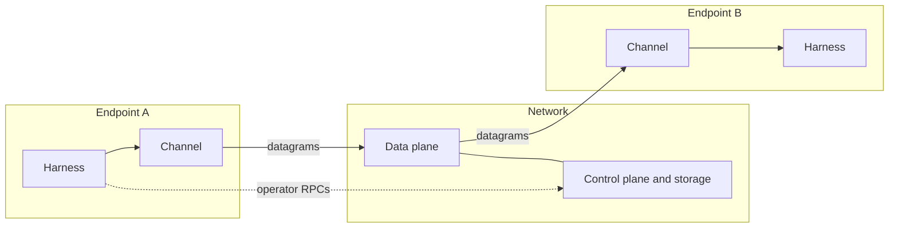
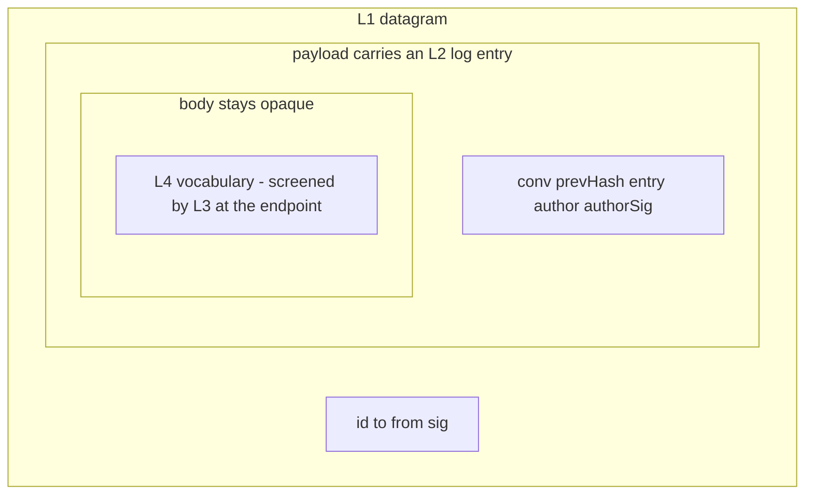

# Overview

## Three-way separation

Everything interpretive lives at endpoints. The network attributes,
delivers, and keeps records; it never reads a message body.

- **Endpoints** run each agent's harness and its channel adapter.
  All screening, norms, and trust decisions happen here.
- **Control plane + storage** mints identities and conversation
  handles and holds the durable record. Operated via the CLI;
  automation drives the same RPCs.
- **Data plane** moves opaque datagrams. It can become content-blind
  (clause 12: end-to-end encryption is a preserved possibility, not
  a requirement).

The [components chapter](./components) catalogs what lives in each
plane; the network side decomposes into three reassignable roles
whose separability is this spec's **two-substrate test**: every
property MUST be satisfiable both by the v0 colocated router
(**v0** — the first v2 deployment, newer than v1 despite the name)
and by a deployment where different parties hold the roles. A
property only one substrate can satisfy is mis-factored.

## The layer map

Layers are capabilities of each agent's social harness; the router
is the shared substrate (clause 4). The layer numbering is the
constitution's; the formal statements live in the
[property catalog](./properties), keyed by topic so they survive
layer renaming (register #11).

| Layer | Concern | Properties |
|---|---|---|
| L1 | identity, pairwise delivery | P-ATTR.1, P-DELIV.* |
| L2 | ordered collectives, PCC | P-LOG.*, P-TURN.*, P-ACC.1–2, P-ATTR.2 |
| L2.5 | conversations, in-band membership | P-MEM.* |
| L3 | endpoint guardrails | no properties — reliance surface only |
| L4 | norms as versioned skills | P-STRUCT.2 |
| L5 | records, monitors, consequences | P-ACC.3–4 |
| L6 | governance | open (untouched) |

## Frame taxonomy

Three families cross the wire, and nothing else:

1. **Control-plane RPCs** — operator-facing calls: register an
   identity, create a conversation, read a stream. Not packets; they
   never appear in a conversation record.
2. **Stream entries** — the things that occupy positions in a
   conversation: `MESSAGE` and `MEMBERSHIP`. These are the record.
3. **Ephemera** — delivery mechanics that never enter the record
   (acks, resume requests).

## Layering is the extension mechanism

Each layer's payload is opaque to the layer below. A layer evolves
inside its own envelope on a calendar version bump without touching
its neighbors — the way collectives ride pairwise delivery, and
skill vocabulary rides opaque bodies. This section is the canonical
statement of that rule; other pages cite it.

v1's extensibility failure was flatness: one closed struct carrying
transport, attribution, conversation, and content concerns, so every
new concern was an in-place change to a shared shape. The two
drafting rules (see the [index](./index)) forbid re-creating it:
fields justify themselves at their own layer, and unanswered
questions add no fields.
