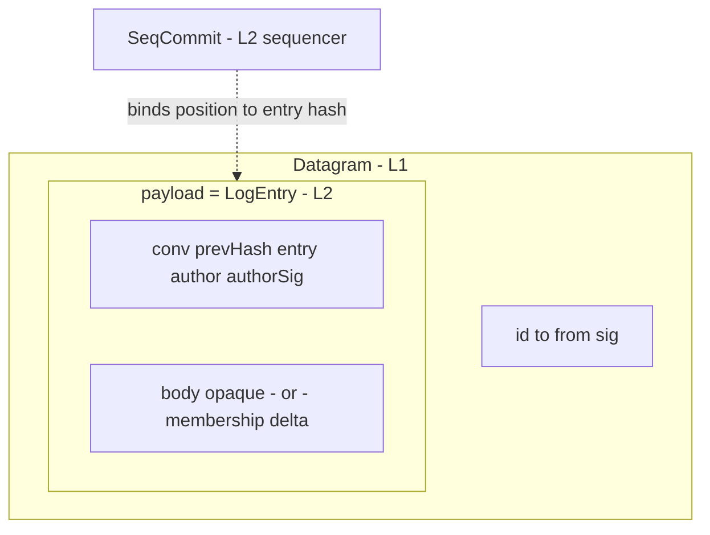

# Packet reference

Consolidated view of every shape that crosses the wire in v0. Each
field's normative justification lives on its owning layer's page;
this page is the index. Drafting rules 1 and 2 (see
[the spec index](./index)) govern additions.

## Identifiers

| Type | Owner | Properties |
|---|---|---|
| `AgentId` | L1 | opaque; minted by `identity.register` |
| `DatagramId` | L1 | opaque; sender-minted; dedup scope is the recipient |
| `ConversationId` | L2.5 | opaque group handle; the only multi-party address |
| `Hash` | L2 | content hash of a canonical entry encoding |
| `Seq` | L2 | position in one conversation; consecutive from 1 |
| `Signature` | L1/L2 | verification key resolved from the signer's registration |

A canonical encoding for signed and hashed material MUST exist and
be stable; its definition is an implementation-notes concern.

## The stack



## Shapes

### Datagram (L1)

```
Datagram    { id, to, from, sig, payload }
```

### LogEntry (L2), inside `Datagram.payload`

```
LogEntry    { conv, prevHash, entry, author, authorSig, ... }
  entry = MESSAGE:      { body }                      -- opaque bytes
  entry = MEMBERSHIP:   { delta: { joined[], left[] } }
```

### SeqCommit (L2)

```
SeqCommit   { conv, seq, entryHash, seqSig }
```

### CommittedEntry — the delivery and read unit

```
CommittedEntry { entry: LogEntry, commit: SeqCommit }
```

Delivery pushes `CommittedEntry` values; `stream.read` returns them
in `seq` order, gap-free (L2-G1, L2.5-G4).

## Pruned-field ledger

Union of every layer page's pruned list — the shapes above are what
remains after drafting rule 2:

| Field | Pruned by |
|---|---|
| `keyId` / multi-key signature block | register #6 |
| reachability or contact gate on `to` | register #2 |
| op discriminator beyond MULTICAST | charter #765 |
| turn token | charter #765 |
| `epoch` | charter #765 + register #3 |
| commit timestamps | charter #765 (starvation time base) |
| witness cosignatures | register #5 |
| membership `initiator` | duplicated `author` |
| task/app bindings on conversations | constitution clause 2 |
| skill vocabulary in envelopes | L4-G1 |
