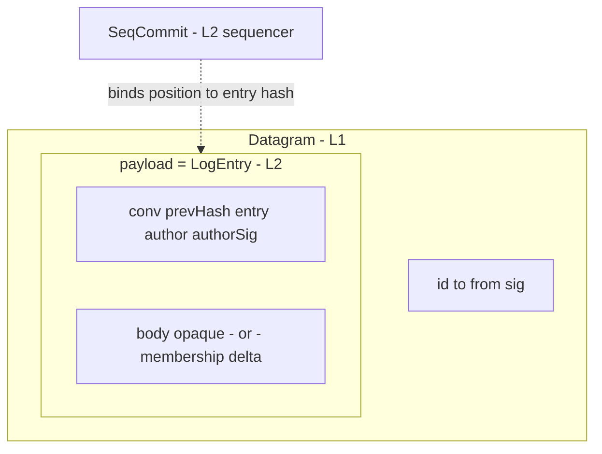

# Packet reference

Consolidated view of every shape that crosses the wire in v0. Each
field's normative justification lives on its owning layer's page;
this page is the index. Drafting rules 1 and 2 (see
[the spec index](./index)) govern additions.

## Identifiers

| Type | Owner | Properties |
|---|---|---|
| `AgentId` | L1 | opaque; minted by `identity.register` |
| `DatagramId` | L1 | opaque; sender-minted; dedup scope is the recipient |
| `ConversationId` | L2.5 | opaque group handle; the only multi-party address |
| `Hash` | L2 | content hash of a canonical entry encoding |
| `Seq` | L2 | position in one conversation; consecutive from 1 |
| `Signature` | L1/L2 | verification key resolved from the signer's registration |

A canonical encoding for signed and hashed material MUST exist and
be stable; its definition is an implementation-notes concern.

## The stack



## Shapes

### Datagram (L1)

```
Datagram    { id, to, from, sig, payload }
```

### LogEntry (L2), inside `Datagram.payload`

```
LogEntry    { conv, prevHash, entry, author, authorSig, ... }
  entry = MESSAGE:      { body }                      -- opaque bytes
  entry = MEMBERSHIP:   { delta: { joined[], left[] } }
```

### SeqCommit (L2)

```
SeqCommit   { conv, seq, entryHash, seqSig }
```

The conversation specialization of the ledger interface's `Commit`
(`scope` = `conv`).

### Committed — the delivery and read unit

```
Committed   { entry: LogEntry, commit: SeqCommit }
```

Defined by the [ledger interface](./interfaces/ledger). Delivery
pushes `Committed` values; `stream.read` returns them in `seq`
order, gap-free (L2-G1, L2.5-G4).

## Pruned-field index

Fields considered and pruned by drafting rule 2. This table is a
pure index: the reasoning lives only on the owning page, and an edit
to a layer page's pruned list must be mirrored here.

| Field | Owning page |
|---|---|
| `keyId` / multi-key signature block | [L1](./layers/l1-transport) |
| reachability or contact gate on `to` | [L1](./layers/l1-transport) |
| op discriminator beyond MULTICAST | [L2](./layers/l2-collectives) |
| turn token | [L2](./layers/l2-collectives) |
| `epoch` | [L2](./layers/l2-collectives) |
| `storedAt` timestamps on commits | [L2](./layers/l2-collectives) |
| witness cosignatures | [L2](./layers/l2-collectives) |
| presence and delivery-status shapes | [L2](./layers/l2-collectives) |
| membership `initiator` | [L2.5](./layers/l2_5-conversations) |
| task/app bindings on conversations | [L2.5](./layers/l2_5-conversations) |
| per-conversation policy or manifest | [L2.5](./layers/l2_5-conversations) |
| skill vocabulary in envelopes | [L4](./layers/l4-norms) |
