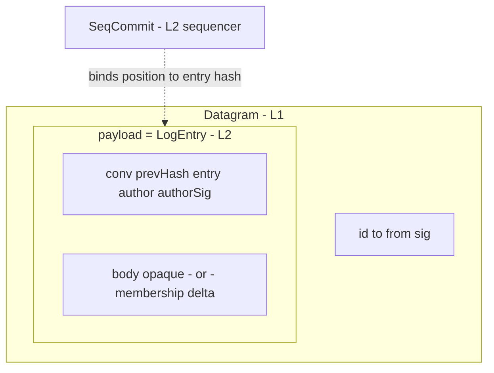

# Packets

Appendix: every shape that crosses the wire in v0. Each field's
justification cites a property from the [catalog](./properties);
drafting rules 1 and 2 (see the [index](./index)) govern additions.

## Identifiers

| Type | Owner | Properties |
|---|---|---|
| `AgentId` | L1 | opaque; minted by `identity.register` |
| `DatagramId` | L1 | opaque; sender-minted; dedup scope is the recipient |
| `ConversationId` | L2.5 | opaque group handle; the only multi-party address |
| `Hash` | L2 | content hash of a canonical entry encoding |
| `Seq` | L2 | position in one scope; consecutive from 1 |
| `Signature` | L1/L2 | verification key resolved from the signer's registration |

A canonical encoding for signed and hashed material MUST exist and
be stable; its definition is an implementation-notes concern.

## The stack



## Shapes

### Datagram (L1)

```
Datagram    { id, to, from, sig, payload }
```

| Field | Justified by |
|---|---|
| `id` | P-DELIV.2 — the key that makes duplicates identifiable |
| `to`, `from` | pairwise addressing; P-ATTR.1 |
| `sig` | P-ATTR.1 — verification key resolved from `from`'s registration |
| `payload` | P-STRUCT.1 — opaque to every network class |

### LogEntry (L2), inside `Datagram.payload`

```
LogEntry    { conv, prevHash, entry, author, authorSig, ... }
  entry = MESSAGE:      { body }                      -- opaque bytes
  entry = MEMBERSHIP:   { delta: { joined[], left[] } }
```

| Field | Justified by |
|---|---|
| `conv` | names the scope (P-LOG.2) |
| `prevHash` | the author's causal claim; P-ACC.2 |
| `entry` | MESSAGE/MEMBERSHIP discriminator; P-MEM.1 |
| `author`, `authorSig` | P-ATTR.2 |
| `body` / `delta` | opaque above L2 / the in-band membership change (P-MEM.1) |

### SeqCommit (L2)

```
SeqCommit   { conv, seq, entryHash, seqSig }
```

The conversation specialization of the transcript store's `Commit`
(`scope` = `conv`).

| Field | Justified by |
|---|---|
| `conv`, `seq` | the position assignment (P-LOG.2) |
| `entryHash` | binds the position to exactly one entry (P-LOG.2, P-ACC.1) |
| `seqSig` | P-LOG.3 |

### Committed — the delivery and read unit

```
Committed   { entry: LogEntry, commit: SeqCommit }
```

Defined by the
[transcript store](./interfaces/transcript-store). Delivery pushes
`Committed` values; `stream.read` returns them in `seq` order,
gap-free (P-LOG.4).

## Pruned fields

Fields considered and pruned by drafting rule 2. This table is the
single home for the reasons.

| Field | Pruned by |
|---|---|
| `keyId` / multi-key signature block | register #6 — with one registered key per agent, verification is fully determined by `from` |
| reachability or contact gate on `to` | register #2 — the shapes work under either answer |
| op discriminator beyond MULTICAST | #765 — op set, completion, failure, initiation authority |
| turn token | #765 — P-TURN.1 semantics: who mints the grant, consensus vs leader |
| `epoch` (membership era stamp) | #765 + register #3 — membership at any position is already derivable (P-MEM.2) |
| `storedAt` timestamps on commits | #765 — P-TURN.2's time base is a charter decision; stores MAY hold receipt times without wire representation |
| witness cosignatures on commits | register #5 — witness semantics |
| presence and delivery-status shapes | #765 — chartered with L2 semantics |
| membership `initiator` | duplicated `author` (P-ATTR.2) |
| task/app bindings on conversations | clause 2 — tasks are endpoint conventions (see [Components](./components)) |
| per-conversation policy or manifest | clause 2 — standing policies do not live in the plane; the next expected op is an L4 concern |
| skill vocabulary in envelopes | P-STRUCT.2 |
