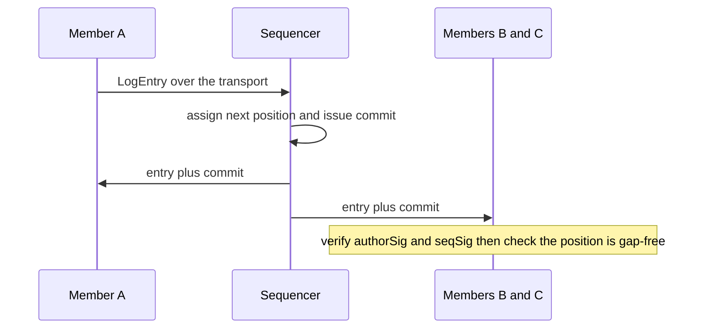
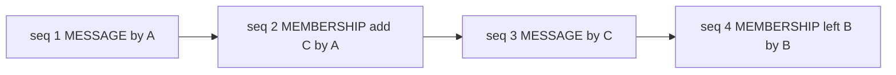
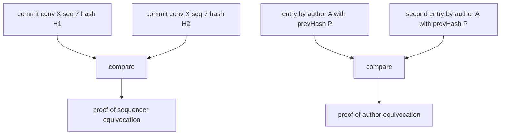

# Properties

The normative guarantee catalog. Cards follow the format defined in
the [index](./index); IDs are topic-keyed and stable. The layer map
in the [overview](./overview) binds groups to constitution layers.

## Vocabulary

Statements quantify over these events and functions:

- `accept(d)` — the transcript store durably holds datagram `d` for
  its recipient
- `deliver(d, x)` — datagram `d` is delivered to endpoint `x`
- `commit(s, p, e)` — the sequencer of scope `s` binds entry `e` to
  position `p`
- `observe(m, s, p, e)` — member `m` accepts `e` as the entry at
  `(s, p)` after verification (R-EP.2)
- `key(a)` — the verification key bound to agent `a` at registration
- `membership(c, p)` — the member set of conversation `c` after
  applying the prefix `1..p` of its log (defined by P-MEM.2)

Positions are per scope, consecutive from 1 (wire name: `seq`).
*Log*, *stream*, and *transcript* name the same ordered sequence at
different altitudes (the abstract object, its conversation view, the
stored artifact).

## P-ATTR — attribution

### P-ATTR.1 Datagram attribution — safety

- **Statement.** For every delivered datagram `d`, `d.sig` verifies
  under `key(d.from)`, and producing a verifying `d` with
  `d.from = a` without holding `key(a)` is infeasible.
- **Reading.** No forged sender identities; every datagram is tied
  to a registered agent acting for a known principal.
- **Target.** Endpoint (R-EP.1 sign, R-EP.2 verify); Control Plane
  (registration binds the key).

### P-ATTR.2 Author attribution survives relay — safety

- **Statement.** For every entry `e`, `e.authorSig` verifies under
  `key(e.author)` regardless of which party delivered `e`; collective
  attribution never depends on the carrying datagram's `from`.
- **Reading.** You can trust who *said* it without trusting who
  *handed* it to you.
- **Target.** Endpoint.

## P-DELIV — delivery

### P-DELIV.1 Durable before delivery — safety

- **Statement.** For every datagram: `deliver(d, ·)` occurs only
  after `accept(d)`, and after `accept(d)` returns, `d` is
  recoverable until acknowledged or retention expires.
- **Reading.** Nothing is pushed that could not be re-fetched; which
  transcript holds it is a deployment decision (see the
  [transcript store](./interfaces/transcript-store)).
- **Target.** Transcript Store (P-LOG.1 supplies it).

### P-DELIV.2 At-least-once — liveness

- **Statement.** If recipient `r` is eventually persistently
  reachable, every accepted `d` with `d.to = r` is eventually
  delivered to `r` at least once. Duplicates are identifiable
  (`d.id`, entry hashes).
- **Reading.** Loss is impossible for a recipient that keeps coming
  back; duplicates are normal and detectable.
- **Target.** Transcript Store (read side); Endpoint (R-EP.4
  resume, R-EP.5 dedup).

### P-DELIV.3 No transport order — stated non-guarantee

- **Statement.** No delivery-order relation is promised between any
  two datagrams, even same sender and recipient.
- **Reading.** Every ordering claim in the system comes from
  positions (P-LOG.2), never from arrival order. Normative: nothing
  above the transport may assume otherwise.
- **Target.** all classes (as an assumption they may not make).

## P-STRUCT — structural invariants

### P-STRUCT.1 Content-blind network — structural

- **Statement.** The behavior of every network class is a function
  of envelope fields only, never of `payload` or `body` bytes.
- **Reading.** The data plane can become end-to-end encrypted
  without changing any interface (clause 12).
- **Target.** Transport Provider, Transcript Store.

### P-STRUCT.2 Vocabulary is body-only — structural

- **Statement.** No skill-defined kind, tag, or schema appears in
  any envelope field; the network cannot be asked to route or filter
  by skill vocabulary.
- **Reading.** Norms change by skill version bump, never by protocol
  change; the network is structurally unable to interpret them.
- **Target.** Endpoint (authoring); all network classes (by
  P-STRUCT.1).

## P-LOG — sequenced logs

Generic over scopes; conversation transcripts and inbox transcripts
are both deployments
([transcript store](./interfaces/transcript-store)). The
**sequencer** named below is a per-scope role within the store's
append path — delegable without moving storage — not a component.

### P-LOG.1 Durable append — safety

- **Statement.** `append` returns only after the entry is durable;
  there is no state where a position is assigned but its entry can
  be lost.
- **Target.** Transcript Store.

### P-LOG.2 Consecutive unique binding — safety

- **Statement.** Within a scope, committed positions are consecutive
  from 1, and for every `p` there is at most one entry hash `h` with
  `commit(s, p, h)` — ever. Consequently, for all members `m₁, m₂`:
  `observe(m₁, s, p, e₁) ∧ observe(m₂, s, p, e₂) ⇒ e₁ = e₂`, and a
  withheld entry is detectable as a gap.
- **Reading.** Same messages, same order, for everyone including
  late joiners — and omission is visible, not silent.
- **Target.** Transcript Store (its sequencer role); Endpoint
  (R-EP.2 checks it).

### P-LOG.3 Non-repudiable assignment — accountability

- **Statement.** Every `commit(s, p, e)` is attributable to the
  scope's current sequencer such that the sequencer cannot deny
  having issued it.
- **Violation evidence.** Two commits for one `(s, p)` with
  different hashes are, together, a transferable proof of sequencer
  equivocation (P-ACC.1).
- **Target.** Transcript Store (its sequencer role).

### P-LOG.4 Prefix-complete reads — safety

- **Statement.** `read(s, after: N)` returns positions
  `N+1, N+2, …` with nothing omitted, up to the requested limit.
- **Reading.** Resume from any held position yields a gap-free
  continuation; combined with P-LOG.2 catch-up is complete and
  verifiable.
- **Target.** Transcript Store.

### P-LOG.5 Immutability within retention — safety

- **Statement.** A committed entry is never altered or removed
  within its scope's retention window (retention: open question #7).
- **Target.** Transcript Store.

The append flow, with both signatures and the gap check:

## P-TURN — pessimistic concurrency (chartered)

The recorded v0 decision is MULTICAST with pessimistic concurrency
control (PCC), nothing more; the charter (#765) owns the semantics.
These cards reserve the property IDs and their informal content so
no other layer claims them; their formal statements are deliberately
absent (drafting rule 2).

### P-TURN.1 Pessimistic concurrency — safety, chartered

An entry is committed only after the group has agreed on the next
collective operation and next author. Formal statement: #765.

### P-TURN.2 Starvation protection — liveness, chartered

No member can be indefinitely prevented from having its operation
considered. Formal statement: #765.

Implementation note (non-normative): the arena case study
re-implemented a ~1,400-line turn scheduler on v1's per-recipient
admission hooks because v1 offered "may this recipient process this
message" where the game needed "who may speak next in this
conversation" — the evidence that P-TURN.1 is first-class. PCC also
keeps logs linear: an author holding the speaking grant knows the
head, so `prevHash` chains without forking. Closest prior art for
the log discipline: per-conversation signed hash chains (Keybase's
sigchains) and membership-changes-as-commits (MLS); chains and
epochs are mechanisms and appear only in notes, never in statements.

## P-MEM — conversations and membership

### P-MEM.1 Membership is in-band — safety

- **Statement.** Every membership change of conversation `c` is a
  `MEMBERSHIP` entry occupying a position in `c`'s own log, totally
  ordered against `MESSAGE` entries. This is the v0 join shape; open
  question #3 (lifecycle under encryption) may later promote join to
  a heavier control-plane operation.
- **Reading.** No side-channel membership notifications; there is
  one history and membership changes are part of it.
- **Target.** Transcript Store; Control Plane (create commits the
  initial entry).

### P-MEM.2 Membership is derivable — safety

- **Statement.** `membership(c, p)` is a pure function of the log
  prefix `1..p`: the initial `MEMBERSHIP` entry composed with every
  subsequent delta. Any member, late joiner, or monitor computes the
  same value.
- **Target.** Endpoint (computes it); Transcript Store (P-LOG.2
  makes it well-defined).

### P-MEM.3 Recipient set — safety

- **Statement.** The recipient set of the entry at position `p+1` is
  exactly `membership(c, p)`.
- **Reading.** Who receives an entry is decided by the ordered
  history itself, not by any component's private state.
- **Target.** Transcript Store / Transport Provider (push fan-out);
  Endpoint (verifiable via P-MEM.2).

The `MEMBERSHIP` entry at seq 2 is why C receives seq 3 — no
side-channel notification, no fan-out timing rules. Implementation
note (non-normative): v1 delivered membership changes as
side-channel notifications with fan-out timing rules and no ordering
against messages; late joiners could not reconstruct historical
recipient sets. P-MEM.1–3 replace that mechanism class entirely.

## P-ACC — accountability

L5's guarantees are derived, not new promises: the record is the
signed material the system already produces.

### P-ACC.1 Sequencer equivocation is provable — accountability

- **Statement.** `commit(s, p, e₁) ∧ commit(s, p, e₂) ∧ e₁ ≠ e₂`
  yields, from the two commits alone, a proof of sequencer
  misbehavior transferable to any third party. (From P-LOG.3.)

### P-ACC.2 Author equivocation is provable — accountability

- **Statement.** Two entries by one author sharing a `prevHash`
  yield, from the two entries alone, a transferable proof of author
  equivocation. (From P-ATTR.2.)

Detection requires only committed material; it does not require
trusting the network. Consequences belong to P-ACC.4.

### P-ACC.3 Non-repudiable provenance — accountability

- **Statement.** For every committed entry, the record yields proof
  of its author (P-ATTR.2), its position (P-LOG.3), and its
  recipient set (P-MEM.2/3) — without trusting the record's holder.
- **Reading.** A transcript store that tampers, reorders, or omits
  is auditable by its own contents (P-LOG.2..5).

### P-ACC.4 Consequences act on credentials — structural

- **Statement.** L5 consequences operate on registrations and keys,
  never on message content. Revocability itself depends on the L1
  key model (open question #6) and is not promised here.

Implementation note (non-normative): v1's records were
server-database rows — attribution a server-stamped column,
membership history unreconstructable, lease state in-memory. None of
it was evidence against a faulty server. The v2 record substrate
inverts the trust direction: the store holds proofs, it does not
produce them.

## Open questions touching this catalog

| Question | Register | Held-open cards |
|---|---|---|
| L2 semantics clusters, presence, delivery status | #765 / #1 | P-TURN.* formal statements |
| router spam-control role between strangers | #2 | none — shapes work under either answer |
| lifecycle under encryption | #3 | P-MEM.1 join shape |
| monitors, witnesses, retention, key model | #4 #5 #7 #6 | P-LOG.5 window, P-ACC.4 revocability |
