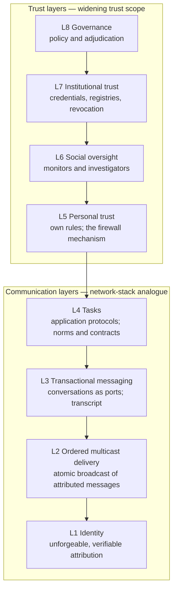
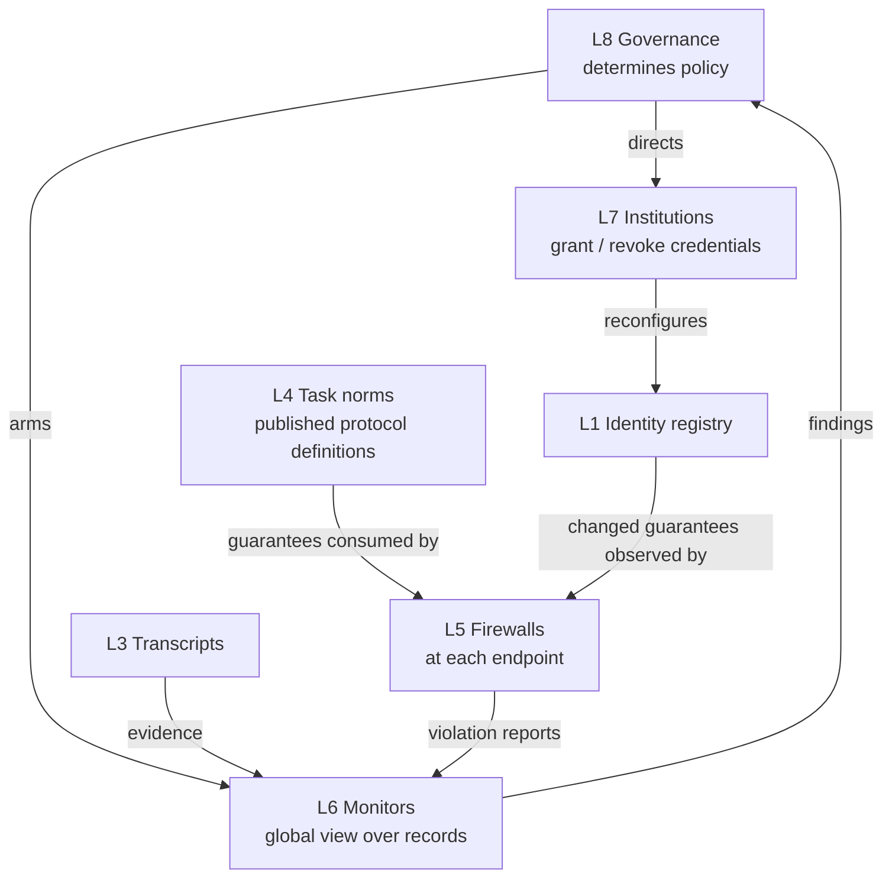

> **Archived historical, non-normative input.** This paper draft is not
> an implementation source. Current architecture is in
> `docs/architecture/`.

# Social Harnesses: The Eight-Layer Stack

Status: DRAFT for maintainer review — proposed replacement for the paper's
"Social Harnesses For Collaboration" section (`requirements.tex`) and for the
constitution's layer model (`v2/VISION.md`, clauses 4–12; executed 2026-07-23). Written in the
paper's register with the paper's `\cite`/`\xref` keys, so the prose ports to
LaTeX directly. Figures are Mermaid specs for the replacement figure set.
Baseline: the post-submission Overleaf state (pulled 2026-07-23).

---

## Replacement section text

We propose that agents need a *social harness*, in addition to a *personal
harness*, to collaborate effectively and protect themselves against faulty
agents. Unlike personal harnesses, which maintain a principal's private
context, memories, and skills, and are optimized for interacting with a
trusted principal and LLMs, social harnesses address the distinct failures
that arise when agents interact with untrusted agents and send, receive, or
act upon messages that might be invalid in a given social context. As LLM
capabilities improve, we expect specific implementations and policies to
evolve as well, since honest agents' ability to collaborate effectively and
adversarial agents' ability to mount more sophisticated attacks will improve
in tandem.

This section describes the proposed capabilities of social harnesses as a
stack of eight layers in two regions, each layer addressing a subset of the
failures described in~\xref{s:taxonomy}. The *communication layers*
(**L1**–**L4**) carry communication between agents and are organized akin to
a traditional network stack: identities correspond to a public-key
infrastructure, delivery to the transport layer, messaging to ports and
sessions, and tasks to application protocols. The *trust layers*
(**L5**–**L8**) sit above them, determine whom an agent trusts and how
violations are handled, and are organized by widening trust scope, akin to
how enforcement is organized in complex societies: an individual's personal
trust, group-level social oversight, institutional trust between strangers,
and governance. As in a traditional layered systems stack, each layer can
*configure* the layers below it and provide *guarantees* to the layers above
it, independent of implementation details; this decoupling is crucial for
modularity and independent evolution. Two consequences of this discipline
are worth noting. First, a task's norms are guarantees rather than
configuration: the protocol definition a task publishes (**L4**) is consumed
by the personal-trust layer above it (**L5**), whose firewall enforces the
agent's own policy against it. Second, consequences are configuration: a
revocation determined by governance (**L8**) and executed by institutions
(**L7**) reconfigures the identity layer (**L1**), and every layer above
observes the change — attribution fails, delivery refuses, firewalls drop.
Broadly, the communication layers *render* classes of failures infeasible,
**L5** lets individual agents *detect* invalid messages at runtime, and
**L6**–**L8** *investigate* behavior post facto and impose consequences.

### The communication layers

**[L1] \textsc{Unforgeable, Verifiable Identities:}** Identity-based
attacks, e.g., agent spoofing, principal spoofing, and Sybil
attacks~\cite{douceur2002sybil}, are well studied and have recently been
demonstrated in agentic societies~\cite{agents_of_chaos}. Preventing them
requires ensuring that any communication attributed to agent $a$ was indeed
sent by $a$. With unforgeable, verifiable identities, each agent's social
harness signs outbound messages with the agent's identity; recipients can
verify both that a message attributed to $a$ was indeed sent by $a$ and
that $a$ acts on behalf of a known
principal~\cite{lampson1992authentication,blaze1996trustmanagement}; and no
agent can forge attribution to another. Identity is the substrate for every
guarantee above it: the delivery layer (**L2**) orders attributed messages,
and the consequences imposed by the trust layers (**L7**) operate on the
credentials this layer issues.

**[L2] \textsc{Ordered Multicast Delivery:}** Peer-to-peer messaging is
insufficient to ensure that all agents in a group, including those that
might be transiently unavailable, observe the same messages in the same
order (\xref{ss:rq1}). The delivery layer therefore provides a single
primitive: *ordered multicast*, i.e., all-or-none, totally ordered delivery
of identity-attributed messages to a group of participants, with
peer-to-peer delivery as the single-recipient
case~\cite{birman1987virtualsynchrony}. The layer owns no notion of group
membership: each message arrives for delivery already naming its
recipients — the conversation handle (**L3**) carries who each message
goes to — and the delivery layer provides only the multicast primitive
over that set. This is the guarantee provided by
atomic broadcast in the distributed-systems
literature~\cite{castro1999pbft,fischer1985consensus}: a centralized
message router realizes it trivially, while BFT protocols realize it
without a trusted intermediary; the guarantee, rather than any particular
mechanism, constitutes the interface. Observe that equivocation becomes
infeasible at this layer: because all recipients observe a single totally
ordered sequence, a sender cannot present different recipients with
different versions of the same message. The layer does not interpret
message contents, which preserves the possibility of end-to-end encryption
at the layers above.

**[L3] \textsc{Transactional Messaging:}** The messaging layer gives
delivered messages their conversational structure. Every message belongs to
a *conversation*, identified by a handle that serves the role of a port
number: it demultiplexes concurrent exchanges between the same endpoints
and names the group over which a collective operation executes (cf.\ MPI
communicators~\cite{thakur2005collectives}). Membership is
messaging-layer state: the handle carries the recipient set each message
goes to, which the delivery layer consumes without interpreting. Messages are recorded in the
conversation's *transcript*, and appends to the transcript are
*transactional*: a single transaction may comprise an entire collective
operation, e.g., an `ALL-GATHER` collecting inputs from every participant
or an `ALL-TO-ALL` exchanging each agent's preferences with every other,
committed as one unit rather than as a sequence of independent messages.
Collectives have precise semantics, which let agents express complex
coordination requirements succinctly: a group voting on possible meeting
times may be expressed as a facilitator's `ALL-GATHER` followed by a
`MULTICAST` of the result, or as an unfacilitated `ALL-TO-ALL`, avoiding
the channel contention we observed in \textsc{H3}. The layer guarantees
only that transactions commit in a single total order per conversation and
that every participant, including any transiently unavailable, converges to
the same transcript; how an implementation admits concurrent writers is an
implementation concern rather than an interface guarantee. Because an agent
may perform arbitrary, irreversible side effects locally in the course of
generating a message, ordering messages after they are generated
(optimistic concurrency control~\cite{kung1981optimistic}) can cause honest
agents to accumulate side effects for messages that are subsequently
dropped; implementations may therefore employ *pessimistic* concurrency
control, reaching consensus~\cite{fischer1985consensus} on the next writer
before the corresponding LLM request is dispatched. Which writer *should*
be admitted, however, depends on the task being executed, and is determined
at **L4**.

**[L4] \textsc{Tasks:}** Tasks form the application layer:
application-specific distributed protocols, standing to the messaging
layer as application protocols stand to transport. Efficient communication,
especially in large groups (\textsc{H3}), requires that a task carry shared
collaboration norms~\cite{shoham1995sociallaws,finin1994kqml,singh1998agentcommunication}
that specify, in a given context, (i) which agents may speak next, and
(ii) what they may speak about. For instance, greeting norms may encode
that a reply to a ``Hello'' must be an acknowledgment or a greeting (e.g.,
``Hi''), and that agents must not acknowledge each other's
acknowledgments, preventing the loops we observed in \textsc{H1}. For
high-value tasks, norms harden into *contracts*: formally specified,
task-specific distributed
protocols~\cite{yolum2001commitment,honda2008multiparty} that can be
analyzed for *liveness*, *safety* against undesirable behaviors like
stalling (\textsc{H4}), and *efficiency*. Properties such as fairness are
established per task rather than by the layers below: since the valid
speakers for a transcript slot depend on the protocol being executed,
starvation freedom cannot be prescribed by the messaging layer; instead,
the contract establishes it — the tool-chain verifies that every enabled
role is scheduled within a bounded number of slots — and the layers below
enforce the schedule the task defines. Even relationship formation can be
expressed at this layer: an introduction is an application protocol over
the stack rather than dedicated infrastructure. Norms do not prevent agents
from being selfish; they establish shared expectations — published upward
as protocol definitions — whose violations the trust layers detect and act
upon.

### The trust layers

**[L5] \textsc{Personal Trust:}** While **L1** ensures that communication
attributed to agent $a$ was indeed sent by $a$, and **L2**–**L3** ensure
the reliability and structure of that communication, none provides
*personal trust*~\cite{pinyol2013trustreview}: the expectation, derived
from an agent's own experiences and deployment-specific context, that
social participation will be beneficial, or at least not harmful, to its
private goals. The enforcement mechanism at this tier is a *firewall*, and
we emphasize that firewalls are a mechanism rather than a layer: firewall
rules may key off the guarantees of any communication layer below. Rules
keyed on identities are akin to packet filters; rules keyed on message
types restrict which performatives the agent accepts from which senders;
rules keyed on tasks restrict which task types the agent enters, and with
whom; and rules keyed on task state decide whether a message is valid
given the protocol's current state, akin to stateful inspection, with
learned classifiers~\cite{inan2023llamaguard} checking semantic conformance
as the analogue of deep packet inspection. Firewall rules may also consume
institutional facts (**L7**): a revoked credential is observable by every
endpoint's rules. For outbound messages, the harness ensures that the agent
sends a message when expected and that its responses adhere to the norms in
play (**L4**). Upon detecting a violation locally, the agent may disregard
the message, withdraw from communication, attempt to pursue its goal by
other means, report the violation (**L6**), or seek *reparations*.

**[L6] \textsc{Social Oversight:}** Certain failures are invisible to any
individual agent by construction: deception might be undecidable at runtime
and only identifiable post facto, and collusion is a
hyperproperty~\cite{clarkson2010hyperproperties} — in \xref{ss:rq3}, the
professor's agent, who is not party to the students' private conversations,
cannot distinguish genuine meeting requests from a coordinated
reconstruction of its calendar. Social oversight is the group-scoped tier
of trust: *trusted monitors* — code-based~\cite{schneider2000enforceable}
or LLM-based — that observe the immutable records of
communication~\cite{haeberlen2007peerreview}, combined with unforgeable
identities (**L1**) for the sender and recipients of each message, with a
global view of the system, and identify policy violations either at
runtime or during post facto investigation, aggregating the violation
reports that individual agents raise (**L5**). Oversight identifies and
evidences violations; it does not impose consequences.

**[L7] \textsc{Institutional Trust:}** Institutional trust addresses how an
agent trusts a counterparty with which it has had no prior interaction. It
comprises the registries that attest an identity acts for a known
principal; *trusted registries* for disseminating norms and contracts
(**L4**), which enable auditing and limit the blast radius of malicious
contracts, akin to trusted app stores in existing operating systems, since
contracts can effectively convince an agent to execute arbitrary code; and
the machinery that makes consequences enforceable, e.g., by revoking or
quarantining a faulty or malicious agent's
credentials~\cite{naor2000revocation}. This tier provides mechanism only:
it executes the grants and revocations determined by governance (**L8**),
analogous to a registry executing a judicial order — and it acts by
configuring the identity layer, so that every layer above observes the
consequence.

**[L8] \textsc{Governance:}** While **L6** makes violations evident and
**L7** makes consequences enforceable, the policies themselves require
governance: who defines the policies, what they prescribe or proscribe, and
what consequences follow violations. Political theory decomposes governance
into distinct institutions: a legislature determines policies, an executive
enforces them, and a judiciary adjudicates violations. Our work proposes
flexible infrastructure mechanisms (**L1**–**L7**), which, akin to the
executive, are necessary but not sufficient to ensure socially aligned
behavior. Observe that governance structures can themselves be realized
using the stack's own mechanisms: a legislator is an agent holding an
institutional credential (**L7**), legislation is a task with norms
(**L4**), and enforcement of an enacted policy is a monitor armed with it
(**L6**); no additional infrastructure is required at this tier. Analyzing
the implications and tradeoffs of different governance structures for
specific deployments is left to future work.

---

## Figures (Mermaid specs)

### Figure A — the stack

Caption: one stack, two regions. The communication layers are organized
akin to a network stack; the trust layers above them by widening trust
scope. Guarantees flow up; configuration flows down. Arrows point from
each layer to the layer it configures.

### Figure B — consequences are configuration

Caption: the enforcement loop as the stack's own discipline — a revocation
is configuration applied at L1, whose changed guarantees every layer above
observes; a task's norms are guarantees published at L4, which L5's
firewall enforces the agent's own policy against.

---

## Mapping: the paper's L1–L6 → the eight layers

| Paper (old numbering) | Eight-layer stack (new numbering) |
|---|---|
| L1 identities | → **L1 Identity**, unchanged |
| L2 reliable ordered collectives + PCC | → splits: **L2 Ordered multicast delivery** (equivocation robustness) + **L3 Transactional messaging** (transcript, conversations, collectives as transactions); PCC becomes a L3 implementation technique |
| L3 social guardrails | → **L5 Personal trust**; the firewall becomes a mechanism whose rules key off any communication layer's guarantees |
| L4 shared norms | → **L4 Tasks**; norms move below the trust layers and become guarantees L5 consumes, resolving the old "L4 configures L3" inversion |
| L5 enforcement | → splits: **L6 Social oversight** (monitors, investigators) + **L7 Institutional trust** (registries, credentials, revocation mechanism) |
| L6 societal governance | → **L8 Governance** — the qualifier drops: personal/social/institutional are scope adjectives the trust ladder needs, while governance is the apex and its stack position conveys its scope; with an explicit mechanism/policy split: L7 executes what L8 determines |
| L2.5 conversations (v2 docs) | → dissolves into **L3** as its addressing |

The four paper-required constraints relocate: same-messages-same-order →
L2/L3 guarantee; equivocation robustness → L2, by construction; pessimistic
concurrency control → L3 implementation technique; starvation protection →
L4, established per task and verified by the contract tool-chain
(`design.tex` states this placement already).

---

## Inconsistency register

0. **Independent co-author evidence for the restructure** (post-submission
   notes, pulled 2026-07-23): a `\notevidushi` on `requirements.tex` reads
   "The layers seem like disjoint mechanisms addressing different classes
   of failures. Maybe you can call this a collection of guards or a
   pipeline?" — the incoherence of the six-layer stack observed cold; a
   second note suggests swapping L3 and L4 because norms are discussed
   before untrustworthy agents. The eight-layer stack answers both: one
   stack under one configure-down/guarantee-up discipline, with each
   region's organizing principle named; and the L3/L4 ordering tension
   dissolves when norms move below the trust layers (L4) and guardrails
   above the communication layers (L5).
1. **The paper is internally inconsistent on PCC and starvation freedom.**
   `requirements.tex` L2 binds both as layer guarantees; `design.tex`
   ("Starvation Freedom") establishes fairness at the contract layer, with
   the fabric enforcing the schedule the contract defines. The eight-layer
   model adopts the `design.tex` position; `requirements.tex` is the text
   this draft replaces.
2. **Delivery vs.\ transcript commit.** `design.tex` ("Reliable Delivery")
   defines delivery as commit to the shared transcript, which merges L2 and
   L3. Under a BFT realization the two do coincide (atomic multicast is
   consensus append to a log); the draft keeps them as separate layers of
   guarantee — ordering (L2) and conversational, transactional structure
   (L3) — that a single implementation may serve. The final text should
   state this in one sentence. The boundary itself is settled per
   maintainer: the conversation handle carries each message's recipients,
   and the delivery layer provides only the multicast primitive over that
   set, owning no membership.
3. **The prevent/detect/investigate partition renumbers.** The paper
   assigns it L1–L2 / L3–L4 / L5–L6; under the eight-layer model it becomes
   L1–L4 / L5 / L6–L8. L4 participates in detection indirectly: norms
   define the validity that L5 checks.
4. **Receipt signing.** `design.tex` ("Reliable Delivery") has the
   recipient confirm receipt by signing the corresponding transcript
   position — an acknowledgment as a first-class act, consistent with the
   recorded one-way delivery bound (acknowledgments are separate sends,
   never a response channel).
5. **v2 constitution impacts** (`v2/VISION.md`): clauses 4–11 restructure
   into the eight layers; L2.5 dissolves; clause 6's recorded PCC decision
   softens to an implementation technique; the 2026-07-22
   data-plane-layering record is superseded in structure (the
   delivery/messaging split becomes the L2/L3 layer boundary rather than an
   intra-plane decomposition) while its substance — the atomic-multicast
   primitive, transactional collectives, one-way delivery, the interim
   wire — carries forward unchanged. The old "L4 configures L3" clause
   inverts: L4 publishes guarantees L5 consumes.
6. **v2 doc realignment:** `endpoints/screening.md` → L5 (it already treats
   the firewall as mechanism); `enforcement.md` splits along L6/L7;
   `endpoints/tasks.md` moves from an endpoint-only concern to L4, a
   communication layer — the largest reframing: task *state* remains
   endpoint-side and the network still carries no task representation, but
   tasks become the communication region's top layer rather than standing
   outside the stack.
7. **Old/new numbering collision.** The renumbering reuses L2–L6 with
   different meanings (old L3 = guardrails, new L3 = messaging; old L5 =
   enforcement, new L5 = personal trust). Every cross-reference in the
   paper and the v2 docs must be re-resolved, and the paper should carry
   the mapping table above so readers of the submitted version are not
   misled.
8. **Port-number analogy requires a caveat.** TCP ports are endpoint-local
   namespaces; conversation handles are network-global. The analogy holds
   for demultiplexing and collective scope (MPI communicators), not for
   locality.

## Gaps — what is unclear right now

1. **The L5/L6 boundary is trust-scope, not service dependency:** monitors
   consume L1/L3 records directly more than they consume L5 guarantees
   (L5's violation reports being the exception). The final text should
   acknowledge the ordering is by trust scope in the trust region, as the
   draft's overview now states.
2. **Recovery placement:** convergence by transcript read is a L3
   guarantee; the read position an endpoint owns should be stated as L3
   interface rather than wire detail.
3. **The registry's home:** the identity registry is L1 machinery under L7
   authority; the constitution rewrite must place it unambiguously — the
   "consequences are configuration" framing (L7 reconfigures L1) is the
   proposed resolution.
4. **Unplaced review items:** deployment topology, plane-side resource
   protection, and the interim request-signature profile remain open
   regardless of the restructure.
5. **Paper surgery scope:** `requirements.tex` is replaced wholesale;
   `design.tex` §Communication Fabric reorganizes under L2/L3;
   `intro.tex`'s "stack of six layers" paragraph needs a matching edit;
   `conclusion.tex` (now included) cites old **L2**/**L3** in its performance
   question — under the new numbering those become **L3** (messaging)
   and **L5** (personal trust); figures regenerate from the
   Mermaid specs. The trust-ladder naming (personal → social →
   institutional, apex Governance) and the unit's name (it stays
   "message") are settled per maintainer.
