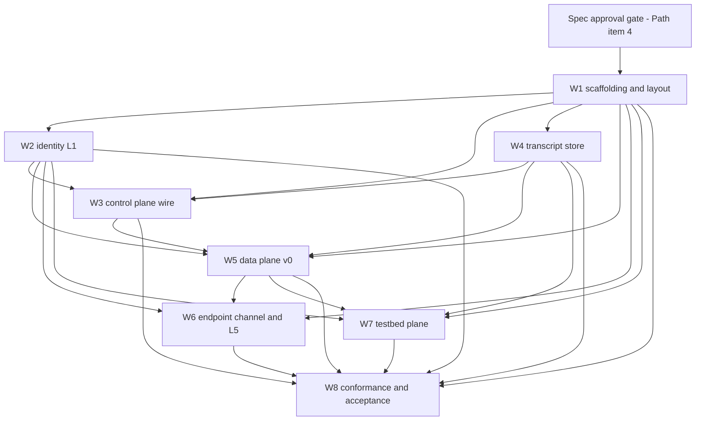

> **Archived historical, non-normative input.** The Gate 1 freeze and
> `docs/architecture/first-implementation.md` replace this plan.

# moltzap v2 — Unified Implementation Plan (v0 slice)

> **Status: DRAFT — maintainer review required before any dispatch.**
> Produced by the `v0-implementation-plan` workflow (7 inventory agents over
> v1 subsystems → 8 workstream planners → synthesis → 2 adversarial
> verifiers; 18 agents, all completed).
>
> Verification round 1 (Appendices A/B) folded 2026-07-24; round 2
> verification pending. Appendices A and B stay below, intact, as the
> round-1 record.

Synthesized from eight workstream plans against the ground truth: `docs/decisions/` (all 2026-07-21/22/23 records), `v2/VISION.md` (constitution + open-question register), and the deepening docs under `docs/spec/`. Binding rules for every item below: v2 code lives under `v2/*` and imports nothing from `packages/*` (salvage = re-implementation, never import — `20260721-v2-lives-top-level.md`); no plan item binds anything the docs leave open; guarantees over mechanisms; spec first — implementation slices wait on the governing chapter's approval (`v2/AGENTS.md`, `v2/VISION.md → The Path` item 4).

---

## 1. Overview

**The v0 slice.** One deployable vertical: an operator-gated identity registry that mints opaque branded agent ids and issues X.509 Ed25519 cards, with every v2-built surface individually signed under the interim RFC 9421 profile (300 s freshness, no sessions, no bearer secrets minted anywhere; the interim WS carriage keeps the recorded connection-binding gap — W5's authentication posture); a control plane serving exactly the five surviving op families — identity register, directory-read-as-cards, conversation list, transcript read, health — on an interim JSON-RPC-over-HTTP wire that pushes nothing, exercisable through the CLI operator face and equally through any signing HTTP client; a transcript store owning one commit-time, gap-free total order per conversation, durable-then-deliver, immutable once committed, with conversation lifecycle riding in-band as L3 entries (START, member-add, leave) and the conversation index derived from them — no control-plane create op exists; a data plane admitting MULTICAST frames content-blind under a per-conversation PCC turn instrument (off-wire, TTL-only expiry), fanning out one-way byte-exact delivery as an optimization over the store; an endpoint channel owning framing/attribution, the endpoint-owned recovery cursor (persistence obligations decided by its M0 spec item), L5 gate mounts, and endpoint-resident contacts, with two harness plugins (OpenClaw and NanoClaw — both real runtimes) as pure consumers; a testbed data-plane implementation of the same interface with envelope-level observation and bounded fault injection; and a doc-cited conformance corpus that proves the acceptance criteria, the implementation-swap equivalence gate (data-plane invariant 11), and the two-consumer falsification (bench + arena as pure consumers).

**The eight-layer target.** The v0 slice is the substrate for the constitution's stack (`20260723-eight-layer-stack.md`; `v2/VISION.md`): communication layers L1 identity (unforgeable frame attribution), L2 ordered multicast delivery (all-or-none, totally ordered, content-blind), L3 transactional messaging (conversations as addressing; collectives as transactional transcript units; lifecycle in-band), L4 tasks (endpoint conventions, no network representation, norms via marketplaces); trust layers L5 personal trust (endpoint gates and contacts), L6 social oversight (monitors over records), L7 institutional trust (registries, revocation — L7 reconfigures L1), L8 governance. v0 implements L1, the L2/L3 MULTICAST+PCC slice, L5's floor, and the record substrate L6 will read; L4 and L6–L8 get no packages and no machinery — deliberate absences, recorded as such.

**Workstreams:**

| ID | Scope | Layer(s) / component |
|---|---|---|
| W1 | v2 workspace scaffolding, package layout, boundary enforcement, CI, publish exclusion | cross-cutting |
| W2 | L1 identity: keygen, cards, RFC 9421, registration, directory, operator trust | L1 / endpoint + control plane |
| W3 | Control plane: interim JSON-RPC op surface (five families), CLI operator face, server composition | control plane (+ CLI as its endpoint-side face) |
| W4 | Transcript store + derived conversation index | control plane + storage |
| W5 | Data plane v0: MULTICAST ship, PCC instrument, lifecycle entries, delivery, interim WS carriage | L2/L3 / data plane |
| W6 | Endpoint channel + L5: agnostic core, contacts, gates, recovery cursor, conversation initiation, OpenClaw + NanoClaw plugins | L1/L2/L3-consumption/L5 / endpoint |
| W7 | Testbed data plane: second implementation, observation, fault injection | data plane (lab) |
| W8 | Conformance and acceptance: framework, property corpus, swap gate, two-consumer falsification | cross-cutting |

**Coordination resolutions (made by this merge; they bind no doc-open question):**

1. **Conformance framework ownership.** W8 owns the conformance framework and property corpus (registry, runner, seed pinning, allowed-gap policy, citation + spec/pin partition disciplines). W7 consumes it and supplies the testbed subject and native injection. W1 stamps the package home (`v2/conformance`) as an empty skeleton naming W8 as owner. The duplicated "suite skeleton" in W1/W7/W8 plans resolves in W8's favor before any framework code is written.
2. **One swap gate.** W7's swap-gate slice and W8's swap-equivalence slice are one CI job: W8 runs the identical corpus against both subjects; W7 supplies the testbed subject factory. Outcome diff must be empty (data-plane.md invariant 11).
3. **CommitBracket co-design.** The store's atomic-append bracket seam (W4) and the PCC instrument that wraps it (W5) agree on the seam signature before either lands; the hard dependency runs W5 → W4. No lease vocabulary appears on any store surface.
4. **Protocol-version value vs. publish exclusion.** All v2 packages are `private: true` (W1); the protocol-version-carriage record makes the v2 protocol package's *published* CalVer the wire version. Interim: the `PROTOCOL_VERSION` constant exported from `v2/wire` reads the **v2 protocol package's** manifest version — a named wire→protocol coupling, so the wire version is always the protocol package's version, never `v2/wire`'s own (`20260723-protocol-version-carriage.md`). With every v2 package private, nothing mints CalVer on protocol source change, so the interim value is static: no conformance property or gate may treat the value as meaningful — only the exact-match mechanism is under test. Enabling publish for the protocol package is a named, future, decision-backed change owned by W3. Neither enabled nor foreclosed here.
5. **Load-bearing ordering.** Live delivery consumption at the endpoint (W6 receive path) does not go live before the endpoint recovery cursor and store cursor reads exist — otherwise the interim wire inherits v1's silent reconnect-window loss while the spec claims convergence. Enforced in the milestone sequence.

---

## 2. Workstream dependency graph

Notes: W1's layout doc (W1.S1) is itself spec work and precedes the gate; every other W1 slice and all implementation slices wait on the gate or an explicit maintainer call to open scaffolding early. W4 blocks W5, never the reverse. W8 is downstream of everything and is the final gate. The graph is workstream-level; the one slice that runs against its workstream's edge direction is W3.S11 (server composition), which consumes W5.S7's carriage and W4's store engine and therefore sits in M5. The optional #788 repair (W5.S8) is main-track v1 work on `packages/*` and sits outside this graph.

---

## 3. Sequenced milestones

Sizing: S/M/L per the source plans. `∥` marks slices in a group that land in parallel.

**Branch mechanics.** M0 and every other spec-side item land on `main` as ordinary PRs (`20260722-spec-lives-on-main.md`); every v2 implementation slice targets the `v2` branch, which receives `main` by forward merge and never merges back before cutover. The one boundary case: W1.S3's violation fixtures are v2 implementation artifacts, so they live with the v2 code on the `v2` branch, while `scripts/architecture/check-boundaries.js` is a main-track file — its fixture self-test runs when the fixtures are present and skips when they are absent, so `main`'s lint stays green without v2 implementation code preceding the gate on `main`.

### M0 — Spec-side work (now; ordinary main PRs; no v2 implementation code)

All parallel; each is independently landable and maintainer-gated:

- **W1.S1 (M)** — Package-layout proposal: fills `docs/architecture/components.md → Component-to-package map` and updates `v2/AGENTS.md → Structure`. Every package keyed to exactly one component (endpoint | control plane + storage | data plane) or cross-cutting, annotated with layer(s), interim markings, reserved slots, and recorded deliberate absences (no L4 package; no L6–L8 packages in v0; no app/task/server-contacts/session packages ever). Unblocks every other workstream's package naming — lands first.
- **W6.S1 (M)** — Adapter API + endpoint package layout spec items (closes channels.md open question 1; named a spec deliverable by `20260721-v2-lives-top-level.md`).
- **W6.S2 (S)** — Cursor-persistence spec proposal (channels.md open question 2) for maintainer decision; gates W6.S9/S11.
- **W7.S1 (S)** — Boundary note fixing the W7/#779 split (supervision/adapters stay main-track testbed; the testbed plane is v2 code) and sketching the PlaneFactory/DataPlaneHandle seam as spec-chapter implementation-notes input.
- **External gates this milestone must obtain:** chapter approvals (control-plane.md, data-plane.md, identity.md, cli.md, enforcement.md, channels/contacts/screening — all currently DRAFT); the maintainer's scaffolding-open call; the testbed-plane home call (W1 reserves the slot only).

### M1 — Workspace bring-up + spec-independent cores (after the gate)

- **Group A (W1, sequential-ish):** W1.S2 (M) canary package `v2/wire` wired end-to-end into the existing toolchain, zero new root scripts → W1.S3 (S) boundary hardening (manifest-dep check, reverse packages/*→v2 check, private-flag guard, violation fixtures under `pnpm lint`) ∥ W1.S4 (S) CI verification by deliberate-violation canary (no workflow edits; `conformance.yml` untouched until a real v2 suite exists) ∥ W1.S5 (S) publish-exclusion verification → W1.S6 (M) stamp remaining skeletons (identity, protocol, server, plane, channel, cli, conformance) + new-package template in `v2/AGENTS.md` → W1.S7 (S) docs toolchain coverage: v2 packages wired into MODULE.md generation (`docs:generate`), `docs:check:drift`, and `docs:check:mermaid`.
- **Group B (parallel, needs only package homes):** W2.S1 (S) ids/keyids ∥ W2.S2 (M) crypto core: card mint/verify ∥ W2.S3 (M) RFC 9421 signer/verifier ∥ W2.S4 (S) operator trust ∥ W4.S1 (S) store scaffold ∥ W3.S1 (S) protocol package scaffold (interim-labeled) → W3.S2 (M) descriptor core ∥ W8.S1 (M) conformance framework skeleton (after resolution 1) ∥ W8.S2 (S) static doc gates ∥ W8.S3 (M) subject seam + stub subject ∥ W7.S2 (M) folds into W8.S1 per resolution 1.

### M2 — Store core + control-plane surface

- **W4 spine (sequential):** W4.S2 (M) durable transactional append with commit-time contiguous positions → W4.S3 (M) genesis path → W4.S4 (M) lifecycle entries + derived index → W4.S5 (M) cursor reads.
- **∥ W3.S3 (M)** wire binding (single-POST dispatcher, fake authority, ProtocolGate, health).
- **After W2.S1–S4:** W3.S4 (M) authority head (verifier bound as descriptor head) ∥ W2.S5 (M) registry + register op ∥ W2.S6 (M) directory reads ∥ W2.S7 (S) verifier-as-authority-head canaries ∥ W2.S8 (S) endpoint card cache; then W3.S5 (M) identity ops on the wire.
- **After W4.S5:** W3.S6 (M) read ops (conversation.list, transcript.read).
- **Suites:** W8.S4 (M) identity suite at interim strength ∥ W8.S5 (M) control-plane store suite (against store fixtures where the plane doesn't yet exist).

### M3 — Data plane v0

- **W4.S6 (S)** CommitBracket seam (per resolution 3) → **W5 spine:** W5.S1 (S) seam + envelope contracts ∥ W5.S2 (M) admission against doubles → W5.S3 (L) PCC turn instrument (off-wire) → W5.S4 (M) MULTICAST ship pipeline → W5.S5 (M) lifecycle entries → W5.S6 (S) delivery fan-out → W5.S7 (M) interim WS carriage behind the seam.
- **∥** W3.S7 (M) control-plane conformance ∥ W3.S8 (S) descriptor-driven doc generation ∥ W3.S9 (M) CLI signing client core (operator key + identity key, custody consumed opaquely — cli.md Q1 open) → W3.S10 (M) CLI op-family commands + the CLI/HTTP identical-results conformance property ∥ W2.S9 (M) L1 acceptance pass ∥ W8.S6 (M) membership/lifecycle suite → W8.S7 (M) data-plane delivery suite.
- **Optional, main-track, any time:** W5.S8 (M) — #788 strict id-less delivery notification repair on the v1 baseline (`packages/*`); gates nothing in v2.

### M4 — Endpoint + testbed (two parallel tracks)

- **W6 track:** W6.S3 (M) agnostic core skeleton → W6.S4 (M) framing/attribution → W6.S5 (M) ContactStore ∥ W6.S6 (M) inbound gate mount ∥ W6.S7 (S) outbound gate mount → W6.S8 (M) one-way receive path (not live until S9) → W6.S9 (M) recovery cursor (needs W4.S5 + the S2-answered spec item) → W6.S10 (M) invitation screening ∥ W6.S11 (M) PCC client half ∥ W6.S15 (S) conversation initiation: client-side minting of a fresh conversation id (collision-free by size), CONVERSATION-START emission through the ordinary send path, and the no-provisioning-bootstrap conformance property (`20260723-lifecycle-rides-l3.md`).
- **W7 track:** W7.S3 (L) testbed plane core (same guarantees, no capabilities) → W7.S4 (M) v0 guarantee property set → W7.S5 (M) observation feed ∥ W7.S6 (M) fault injection ∥ W7.S7 (S) scripted counterparty kit → W7.S8 (M) run-artifact recorder.
- **∥ W8.S8 (M)** adversity tier (production-subject injection external; native arrives with W7.S6).

### M5 — Integration and final gates

- **W3.S11 (M)** server composition — the runnable `v2/server`: process wiring of the W3 dispatcher + W4 store + W5 delivery listeners; storage-engine choice behind the W4 store port; configuration surface (operator key as deployment configuration — `20260723-interim-signature-profile.md`); split listeners per `20260721-physical-plane-split.md` (data traffic never rides the control endpoint). Precedes W5.S9's end-to-end run.
- **W5.S9 (M)** end-to-end N-missed-sends recovery + v0 property registration against both planes.
- **W6.S12 (L)** the OpenClaw harness plugin as pure consumer ∥ **W6.S14 (M)** the NanoClaw harness plugin — the second real runtime the two-runtime gate consumes (both runtimes already exist and run against v1's testbed; the v1 harness-specific plugins are the salvage pattern, re-implemented against the v2 adapter API) ∥ **W6.S13 (M)** channel conformance properties.
- **W8.S9 (S)** coverage ratchet + constraint traceability (closes only when charter #765 states the four constraints).
- **W8.S10 (L)** implementation-swap equivalence gate (one job per resolution 2; subsumes W7.S9), including the v1 scripted-fault-tier reproduction map with explicit allowed-gap entries.
- **W8.S11 (L)** two-consumer falsification harness — the final gate: bench-shaped and arena-shaped consumers over published interfaces only (the bench observer joins each conversation as a member — the v0 posture), two real runtimes in one conversation (the OpenClaw and NanoClaw plugins), no-internal-reach oracle. A failure here is an interface gap filed against the owning workstream, never patched in the harness.

---

## 4. Workstreams

### W1 — v2 workspace scaffolding and package layout

**Deliverables.** Component-to-package map landed as spec text (fills `docs/architecture/components.md`'s deferred section + `v2/AGENTS.md → Structure`, ordinary main PR): cross-cutting `v2/wire` (branded ids, PROTOCOL_VERSION — sourced from `v2/protocol`'s manifest version per resolution 4's named wire→protocol coupling — + segment comparator, strict-decode machinery, wire-error base, opaque list cursor), `v2/identity`, `v2/conformance` (W8-owned); control plane `v2/protocol` (interim-labeled), `v2/server`; data plane `v2/plane` (interface seam + production v0 implementation), `v2/testbed-plane` (reserved slot only, pending maintainer call); endpoint `v2/channel`, `v2/cli`, harness-plugin slots (reserved, created by W6 after the adapter-API spec item). Interim non-`@moltzap/` npm scope; `private: true` everywhere. Workspace bring-up via one canary package proving `pnpm build/lint/test` cover v2 unchanged. Compile-clean skeletons for approved packages (closed export maps, empty barrels, owner-workstream READMEs — no implementation code). Hardened `scripts/architecture/check-boundaries.js`: manifest-level v1-dep check, reverse packages/*→v2 check, examples/*→v2 check (examples may not import v2 until a v2 package publishes), private-flag guard, export-map assertions, violation-fixture self-tests under `pnpm lint` (fixtures live with the v2 code on the `v2` branch; the main-track script skips its fixture self-test when fixtures are absent — see Branch mechanics, §3). CI verified, not invented (`ci.yml` needs no edit; `conformance.yml` untouched until a real suite). Docs toolchain coverage: v2 packages wired into MODULE.md generation, `docs:check:drift`, and `docs:check:mermaid` (the `docs` skill requires Mermaid-in-JSDoc surfaced via generated MODULE.md pages). Publish exclusion preserved, not decided. New-package template/checklist in `v2/AGENTS.md`.

**Interface sketches.** Package-map entry (name + component + layer(s) + duty + interim/permanent + owner) as the admission contract for every future v2 package. `v2/wire`: branded AgentId/ConversationId, PROTOCOL_VERSION (reads the v2 protocol package's manifest version — resolution 4's named coupling; never `v2/wire`'s own) + exact-match segment comparator (missing segments compare as zero), strict-decode guard machinery (normativity register-open), tagged wire-error base, opaque bounded-limit list cursor. Boundary-script contracts: v2-src-no-v1-imports, v2-manifest-no-v1-deps, packages-no-v2-imports, examples-no-v2-imports (until a v2 package publishes), v2-private-until-decided, v2-export-map-closed — each with a fixture that must fail lint.

**Acceptance (cited).** Layout lands as spec text through an ordinary main PR (`20260721-v2-lives-top-level.md`: layout deferred to the spec; `20260722-spec-lives-on-main.md`). Every repo-touching slice waits on the Path-item-4 gate (`v2/VISION.md`). Boundary violations fail mechanically with committed fixtures (`20260721-v2-lives-top-level.md`; `v2/AGENTS.md → Zero v1 imports`; `v2/VISION.md → Provenance`). Every package annotated with exactly one component (`docs/architecture/components.md`) and its layer(s); L4/L6–L8 recorded as deliberate absences (`20260723-eight-layer-stack.md`). Protocol package labeled interim with OpenAPI named as retirement path (`20260722-control-plane-encoding.md`). No production package depends on the testbed-plane slot (data-plane.md → The testbed data plane (recorded): "Production never depends on it"; `20260723-eval-plane-is-testbed.md`). `publish.yml` allowlist untouched; v2 publish enablement recorded as a future decision (`v2/VISION.md` clause 14; `20260723-protocol-version-carriage.md`). No vacuous-green conformance CI (`v2/inputs/debt-inventory-20260718.md`).

**Guarded open questions.** Wire discipline (register 9): guard machinery only, no assertion of excess-key rejection anywhere. Failure taxonomy (register 8): error base carries no taxonomy contents. Naming (register 10): package names copy spec-doc names; rename on register resolution is recorded as cheap. Data-plane wire (data-plane.md Q10): `v2/plane` interface is in-process, no wire schemas. Adapter API (channels.md Q1): channel skeleton carries duties in README, not types. Testbed-plane home: slot reserved, not created. v2 publishing/final names: preserved mechanically, neither enabled nor foreclosed. Witness/operator read-back, retention, monitor access (register 3/4/6): server skeleton binds no store schema or role vocabulary. Charter ground (#765): no scaffold names presence, leases, delivery status, escrow, archive, or any collective op.

### W2 — L1 identity

**Deliverables.** Greenfield crypto surface (v1 has zero Ed25519/X.509/RFC 9421 code; salvage limited to patterns). Branded opaque AgentId + keyid URI codec (`moltzap://agent/<id>`, `moltzap://operator`). Endpoint-side Ed25519 keygen with Redacted private-key custody — the plane never holds a secret. Registry-side X.509 card minter per the recorded field mapping and holder-side verification over the certificate's signed structure (library, never hand-rolled canonicalization). RFC 9421 Ed25519 request signer/verifier per the interim profile. One verification path everywhere: resolve keyid → fetch registry card → verify → exactly one of two caller classes; stateless between requests. Operator key as deployment configuration. Operator-gated register op returning public material only. Directory read serving cards, paginated, no thinner projection, no visibility filtering. Issued-at-keyed endpoint card cache with one refetch on failure. Verification middleware as the descriptor authority head. A binding-neutral attribution-verification interface so interim (sign-the-request) → target (sign-the-frame) changes no downstream shape. Deliverable absences as deliverables: no bearer secrets (the no-secret sweep scopes to v2-built surfaces; the interim WS carriage's connect-bound identity is the recorded migration-baseline gap, governed by W5's authentication-posture deliverable), no connect op, no session/nonce state, no app registration, no rotation RPC, no revocation op, no peer card custody, no frame-signing code under the interim binding.

**Interface sketches.** `generateIdentityKeypair` (endpoint-side, Redacted custody); `AgentId` (opaque, registry-minted, survives rotation); keyid codec (total round trip; rejects everything else); `CardMinter` / `verifyCard` (recorded X.509 mapping; tamper = typed failure; verifies regardless of source); `RequestSigner` / `RequestVerifier` (covered components, keyid/created/expires, ≤300 s window, stateless); `Caller` = registered identity | operator, no third arm constructible; `CardResolver` (server-side reads registry store; endpoint-side via cache; seam keeps peer custody expressible, unbuilt); `IdentityRegistry.register` (operator-gated mint, public material only); `Directory.resolve/enumerate` (cards, W1 cursor); authority-head requirement tags folding into per-method wire error unions; `AttributionVerifier` (binding-neutral, held identically by recipients and L6 readers).

**Acceptance (cited).** Card fetched from any source verifies as the identity it describes and exposes its registered principal; criteria hold at request-attribution strength only under the interim binding (identity.md → Acceptance). Every identity linked to a known principal at creation (identity.md inv. 3); identity attests who, never intent (inv. 5). Exactly one caller per request, no session state (control-plane.md inv. 3); exactly two caller classes (inv. 7). Register operator-gated; directory serves cards paginated (control-plane.md → Op families; `20260723-directory-serves-cards.md`). Interim profile verbatim: components, parameters, freshness, no nonce store, keyid URIs (`20260723-interim-signature-profile.md`). Bearer secrets never exist on any v2-built surface; the plane stores only public material (`20260721-single-credential.md`; the interim WS carriage's connect-bound identity is the recorded migration-baseline gap tolerated per W5's authentication-posture deliverable). X.509 mapping verbatim; verification over the signed structure (`20260721-x509-card-container.md`). Version header inside covered components; mismatch refused before state change (`20260723-protocol-version-carriage.md`). No establishment op anywhere (`20260721-sessionless-network.md`). Name salvages v1's agent-name rule; deliberately-absent card fields stay absent (identity.md → Card fields).

**Guarded open questions.** Register 5 (key model): no rotation RPC, no revocation op (v0's only revocation observable is the registry ceasing to vouch at next resolve), no nonce store, no frame-signing code; binding-neutral verifier keeps the migration sign-the-request → sign-the-frame. Principal linkage depth: one opaque SAN URI, no chains. Register 9: strict decode is machinery reuse only. Card custody residual: peer serving expressible, unbuilt. Register 8: refusals through W1's interim tagged errors, no minted taxonomy. X.509 profile beyond recorded fields: minimal, documented interim, container swappable. Replay posture: 300 s window as recorded; no preemptive tightening. Operator key: bound only as "deployment configuration". Registration gate: operator signature only; no invite-code shared-secret revival without a new record.

### W3 — Control plane (interim wire)

**Deliverables.** Interim protocol package (explicitly "an interim artifact of the current wire, never a fixture v2 owes" — `20260722-control-plane-encoding.md`): re-implemented defineOp-style descriptor factory frozen at module load, strict-decode as machinery, one minimal non-normative Refusal, branded ids, opaque bounded ListCursor. Single-POST JSON-RPC binding over a closed catalog of exactly the five control-verdict families (register; directory resolve + enumerate; conversation list; transcript read with the cursor v1 never had; health) — request/response only, nothing push-shaped, no lifecycle op of any kind. Per-request authentication as the descriptor authority head (W2's verifier); dispatcher constructible only with an authority head, so nothing is exercisable unsigned by construction. Protocol-version carriage: `moltzap-protocol` header inside the covered components, exact match, refused before any state change, no min/max. No-lifecycle-op absence shipped as a tested property (catalog-closure check: control column, nothing from dies). Conformance per descriptor + catalog-vs-coverage ratchet + the read-side acceptance properties. Descriptor-driven doc generation with generator-owned nav (closing v1's hand-pasted docs.json drift), documented as time-boxed, migrating to OpenAPI at the recorded target. Positive canaries pinning handler-error ⊆ wire-refusal-union sound by construction. The CLI operator face (constitution clause 3; W3.S9–S10): a signing client core holding the operator key and an identity key (custody consumed opaquely — cli.md Q1 open), the five op families as commands derived from the same descriptors, and the identical-results conformance property (every family through the CLI ≡ any signing HTTP client) registered in W8's corpus. Server composition (W3.S11): the runnable `v2/server` — process wiring of the dispatcher, the W4 store, and the W5 delivery listeners; storage-engine choice behind the W4 store port; configuration surface with the operator key as deployment configuration (`20260723-interim-signature-profile.md`); split listeners per `20260721-physical-plane-split.md` — data traffic never rides the control endpoint.

**Interface sketches.** `defineOp` (frozen descriptor: method, schemas, ordered authority list headed by signature verification, refusal set); `ControlCatalog` (closed table of six descriptors; handler table and dispatch map both derive from it); `RequestAuthority` (per-request head, two-arm Caller, retains nothing); consumed contracts: W2's verifier + mint, W4's conversation-index and transcript reads; `ListCursor` (single fail-closed decoder, bounded limit, shared across the three list-shaped ops); `ProtocolGate` (exact match before any handler effect); `Refusal` (one interim value, "the op did not take effect", non-normative pending register 8); catalog doc generator with CI drift gate; CLI command table derived from the ControlCatalog (one command per descriptor; signing via W2's signer; key custody opaque); `ServerComposition` (dispatcher + store + delivery listeners in one process; storage engine behind the store port; operator key as deployment configuration; control and data listeners split).

**Acceptance (cited).** Catalog closure: exactly the five control-verdict families, nothing from *dies* (control-plane.md → Acceptance + Dissolution notes). No control-plane create op (`20260723-lifecycle-rides-l3.md`). Every op a single plain HTTP request; nothing exercisable unsigned (control-plane.md → Wire binding). Version mismatch refused before state change (`20260723-protocol-version-carriage.md`). Interim profile applied on every op, version header demonstrably signed (`20260723-interim-signature-profile.md`). Sessionless, two caller classes (control-plane.md inv. 3, 7). Directory returns cards only, unfiltered (`20260723-directory-serves-cards.md`). Member-scoped transcript windows; recovery of exactly N records in order via reads alone; overlapping reads agree; ack implies read visibility; membership change at one position (control-plane.md → Op families + Acceptance). No body-derived behavior anywhere; byte-exact opaque bodies (inv. 1). Request/response only, no push (control-plane.md → What it is not). Every control-plane op family is exercisable through the CLI and equally through any signing HTTP client, with identical results (cli.md → Acceptance; the CLI half is W3.S9–S10, the identical-results property registered in W8's corpus).

**Guarded open questions.** Failure taxonomy (register 8; control-plane.md Q5): one non-normative Refusal; JSON-RPC error frames for encoding-level failures only; conformance asserts effect, never shape. Wire discipline (register 9; Q6): strict decode is an implementation default in no normative text. Witness/operator read-back (register 4; Q1/Q2): member-scoped reads only; the read gate enumerates no scope vocabulary. Retention/horizon (register 6): membership-only gating; cursor addresses positions independently of entitlement. Monitor access (register 3): two-arm Caller is the guard. Presence/delivery-status (#765): nothing push-shaped is representable. Key model (register 5): profile consumed as-is. Data-plane wire (Q10): control ops only, own surface. Encoding target: descriptors stay the single schema source; superseding REST+OpenAPI takes a new record. Operator custody (cli.md Q1): key consumed opaquely. Registration ergonomics and the monitor face (cli.md Q2/Q3): open; the CLI ships exactly the five families, nothing monitor-shaped.

### W4 — Transcript store

**Deliverables.** Durable per-conversation transcripts of byte-exact opaque frames (recipient verification, L6 re-verification, and re-delivery all run over the admitted bytes). Store-owned total order assigned *inside* the commit transaction — killing v1's seq-at-insert-start class; gap-free under concurrent writers without relying on PCC's one-writer discipline. Durable-then-deliver commit contract: ack implies durability; fan-out consumes committed entries only. Genesis creation: CONVERSATION-START to a fresh client-minted id creates transcript + entry zero + derived-index row atomically; id-freshness = in-transaction id-uniqueness; no create op, not even interim. v0 lifecycle entries in-band (START, member-add, leave) occupying positions in the same order as messages; conversation/membership index derived transactionally, never written by any API. Contiguous cursor reads (member-scoped windows; paginated own-conversations list — the control plane's only two reads here). Immutability: no update, soft-delete, or rewrite path exists (v1's `is_deleted`, verdict UPDATEs, and rotation rewrites have no successor). One commit = one transaction; the v0 unit is one frame or one lifecycle entry; the unit's internal shape stays chartered. CommitBracket seam the PCC instrument wraps — the store exposes a transaction, never a lease. Deliberate absences verified by test: no verdict column, no task_id, no server-held read positions, no body-derived projections, no disconnect-keyed state. Store-local property tests keyed one-to-one to doc criteria, packaged for W8.

**Interface sketches.** `TranscriptStore.append` (one unit, one transaction, commit-time contiguous position, returns after durability); `appendGenesis` (atomic iff id unused; reuse refuses with no side effects); `read` (contiguous window, byte-exact frames + positions, scoped through AccessScope); `listConversations` (derived index, paginated); `ConversationIndex.membershipAt` (membership from lifecycle entries at/before a position; determines delivery sets and read scope); `AccessScope` (single entitlement seam; v0 checks membership only; future witness/operator/horizon policy plugs here without schema change); opaque fail-closed Cursor with one sanctioned decoder; branded Position (store-assigned; never under sender attribution — identity.md → Not frame fields); `CommitBracket` (begin/commit/abort; abort leaves no trace); typed internal refusals (IdInUse, UnknownConversation, NotAMember, InvalidCursor) whose wire projection belongs to W3, not the store.

**Acceptance (cited).** Storage guarantees 1–9 verbatim (control-plane.md → Transcript storage guarantees): durable-then-deliver; store-owned total order; contiguous ordered reads that never disagree; recovery by reading exactly N records; lifecycle in-band at one position for every reader; immutability; content-blind byte-exact bodies; member-scoped reads guaranteed (witness/operator open and unbuilt); collective units transactional. Genesis admission checks attribution and id freshness, nothing else; the registry becomes a derived index (`20260723-lifecycle-rides-l3.md`). Refusal before durability (data-plane.md → Admission, inv. 4); convergence on recovery (inv. 3); byte-exact carriage (inv. 13; identity.md → Byte preservation). Bench observes end-to-end through transcript reads; arena's visibility from membership + member-scoped reads (control-plane.md → Acceptance).

**Guarded open questions.** Witness/operator read-back (guarantee 8's open half; register 4/6): all entitlement behind AccessScope — a later decision changes one function, not the schema. Retention/horizon (register 6): no pruning or horizon machinery; membership-gated read is operational posture, never spec text. Wire discipline (register 9): machinery only. Failure taxonomy (register 8): internal typed errors only. Feed cursor (data-plane.md Q10): the read cursor is the control-plane Read op's; no feed shape bound. Unit internal shape (#765): nothing fixes multi-entry layout. Envelope visibility fields (Q1): no witness/epoch columns minted. Turn-state durability (Q5): nothing lease-shaped enters durable records. Presence/delivery-status (Q3/Q4): no delivered[] accounting. Escrow/ARCHIVE (#765): entry vocabulary exactly START/member-add/leave + message; no half-open state in the store; no observable expiry semantics. Lifecycle under encryption (register 2): entries stored as opaque frames; at-rest encryption is operator hardening, never a guarantee. Monitor access (register 3): no monitor-shaped read path.

### W5 — Data plane v0 (L2/L3 interim wire and lifecycle)

**Deliverables.** The v0 ship pipeline for MULTICAST: version gate → admission → turn claim → durable append (store API) → finalize → ack, with ack only after durability and every refusal before durability. Admission, envelope-fields-only: attribution at the binding in effect, sender exists and is active, sender is a member — or a CONVERSATION-START to a fresh id; refusals never mutate membership. Re-implemented PCC turn instrument, strictly off-wire ("an instrument, never an interface" — data-plane.md → Reuse): claim → append → finalize bracket with rollback; per-conversation exclusivity (fixing the recorded v1 gap); TTL-only expiry that never fires mid-append; no disconnect-keyed transition; exactly one committed record per finalized turn — no grant coalescing. v0 lifecycle entries as in-band L3 entries; genesis via the store's atomic path; half-open state as per-conversation coordination state expiring by bounded timeout; no create op. One-way delivery fan-out as an optimization over the store: post-commit, byte-exact frame + store-assigned position pushed to membership-at-entry-position; fire-and-forget; delivery accounting is content-free telemetry, never semantics. Wire seam: one module owns the interim WS/JSON-RPC shapes; W5.S7 mirrors the v1 push/ship shapes minus two of the three recorded gaps it must not import (id-bearing push, mixed traffic — `20260722-data-plane-layering.md`); the third, connection-bound identity, is tolerated per the posture below. Interim data-surface authentication posture (named deliverable, W5.S7-owned): the interim signature profile is an HTTP profile, so the WS *upgrade request* — an ordinary HTTP request where `@method`/`@target-uri` exist — is signed under it, binding the accepted connection to the verified identity; no bearer is minted anywhere (W2's no-secret sweep holds on every v2-built surface), and the residual, tolerated migration-baseline gap narrows to connection-bound identity itself (`20260722-data-plane-layering.md` names it); the target data-surface posture belongs to data-plane.md Q10 and is not bound here. Turn-claim carriage (named deliverable, owned by W5.S7): the claim/grant signal that lets endpoints observe admission before generating (data-plane.md inv. 5) crosses the interim wire by mirroring the v1 baseline's grant push — a non-normative migration mechanism confined to the WireCarriage seam; the normative carriage is the charter's turn-signal carriage (data-plane.md → Wire surface), so no v2 spec text, public type, or property names the interim shape; W6.S11's observe-before-generate consumes this signal through TransportPort. Protocol-version on the frame envelope, exact match, refused before state change. Recovery enablement: position rides the carrier protocol, never under sender attribution; the plane retains nothing per-endpoint. Optional main-track #788 repair (strict id-less notifications on the v1 baseline). Canaries + the v0 conformance property set authored with W8 and run against both plane implementations.

**Interface sketches.** `DataPlane.ship` (one attributed frame → ack with store-assigned position); `DeliveryPush` (one-way, best-effort, strictly after durability, never the source of truth); `Admission.check` (envelope-only; Refuse never touches membership); `TurnInstrument` (internal: claim/finalize/rollback; state fully derivable from conversation, holder, deadline, last committed position — reconstructible after restart without binding Q5 either way); lifecycle entry vocabulary exactly START | MEMBER-ADD | LEAVE; `MembershipAt` (delivery set = membership at the entry's position); `HalfOpenState` (bounded timeout, no observable semantics beyond ceasing to exist); `WireCarriage` seam (the only module knowing interim shapes; swap = wire change, never spec change); `VersionGate`; consumed `StoreAppend` contract (W4).

**Acceptance (cited).** N-missed-sends recovery via reads alone (control-plane.md → Acceptance). Ack never precedes durability (guarantee 1 / data-plane.md inv. 4). Per-conversation total order with convergence (inv. 3). Turn-disciplined admission observed before generation; at most one admitted turn per conversation (inv. 5 + Implementation notes' recorded v1 gap). One-way delivery; responses are first-class sends (inv. 14; `20260722-data-plane-layering.md`). Admission never mutates membership (inv. 9). Byte-exact frames at every hop (inv. 13; identity.md → Byte preservation). Membership change at one position (guarantee 5). Genesis checks attribution + freshness only; no interim create op; v0 entries are START/member-add/leave (`20260723-lifecycle-rides-l3.md`). Version as envelope field, exact match, refused before state change (`20260723-protocol-version-carriage.md`). No lease on any wire surface; TTL-only expiry (data-plane.md → Reuse, Implementation notes; `20260721-sessionless-network.md`). No per-endpoint state; resuming at a position ≡ never disconnecting (`20260721-sessionless-network.md`; inv. 12 carries the no-session-state half). Swap equivalence jointly with W7/W8 (inv. 11). Interim criteria at request-attribution strength only (identity.md → Acceptance).

**Guarded open questions.** Q5 (turn survives restart): reconstruct-from-store as the non-binding-safe default — no durable lease table, no wire-visible restart semantics; either future answer fits behind the instrument. Q10 (wire surface): interim shapes live only inside the seam as non-normative mechanism; no v2 spec text, public type, or property names them. Q4 (positive ack): no delivery-status bookkeeping; #788 removes an accidental transport ack rather than adding a semantic one. Charter clusters (#765): MULTICAST + three lifecycle entries only; no agreement signal on any wire; no presence from lease transitions; no ARCHIVE; bare bounded-timeout half-open expiry. Register 9: no normative excess-key statement. Register 8: refusal reasons stay typed internal values. Q1 (visibility fields): delivery set solely from membership-at-position. Register 5: one verification interface "at the binding in effect"; no nonce store; stored records never claimed as frame-signed evidence. Register 2: bodies opaque end to end. Baseline gaps: neither blessed nor fixed ahead of the migration.

### W6 — Endpoint channel + L5

**Deliverables.** Adapter API + endpoint package layout as spec items (M0; precondition for any channel code). Agnostic channel core: one serialized inbound pipeline per endpoint with park/retry (re-implemented from the v1 channel-core *shape* — `contacts.md → Implementation notes` — never imported), a TransportPort seam isolating the interim wire, gate slots, enrichment with untrusted-string sanitization. Framing/attribution behind one binding-agnostic verification interface (interim RFC 9421 request signing; target per-frame), plus a CardResolver with issued-at cache and single refetch. One-way receive via a defect-isolated typed subscriber registry; the channel never answers on the delivery path. Endpoint-owned recovery cursor whose persistence obligations are decided by the W6.S2 spec item (channels.md Q2) — peek-then-commit with a per-conversation dedup window is the candidate shape, decided by S2; convergence by transcript reads after any miss (net-new — v1 documents silent reconnect-window loss). L5 gate mounts as first-class slots (inbound between verification and agent; outbound between agent and shipping), fail-closed, verdicts agent-local, gates never alter frames or attribution. ContactStore implementing the interface floor — allow / deny / limit / per-endpoint default posture — keyed on the card-subject identity, endpoint-persisted, consumed for traffic and invitations, standing surfaced into context; optional TOFU pinning; changes are local acts with immediate effect and zero network involvement. Invitation screening: lifecycle entries pass the same verify-then-gate path; the inviting identity resolves against contacts before exposure; refusals are agent-local disregard. PCC client half: observe-admission-before-generation, ack/verdict race absorption, single-shot per-turn reply guard, severed from batching. Conversation initiation (W6.S15): client-side minting of fresh conversation ids (collision-free by size — `20260723-lifecycle-rides-l3.md`), CONVERSATION-START emitted through the ordinary send path, first-conversation bootstrap requiring no provisioning, pinned by a no-provisioning-bootstrap conformance property. Two conforming harness plugins as pure consumers — OpenClaw (W6.S12) and NanoClaw (W6.S14), both real runtimes already exercised by v1's testbed, re-implemented against the v2 adapter API; the two-runtime joint gate (W8.S11) consumes both. Channel conformance properties in the shared suite (closing v1's vacuous-green channel conformance), including the gate-configuration expressibility check: arena's channel-secrecy/role-scoped conventions and the bench's faulty-counterparty tolerance expressed as L5 gate configurations with no router participation (screening.md → Acceptance, criterion 1; paired with W7's scripted faults).

**Interface sketches.** `ChannelCore` (composes transport, framing, contacts, gates, cursor; enriched inbound stream + send); `TransportPort` (ship, one-way deliveries, transcript window reads, conversation list; plane refusals pass through as opaque typed values); `FrameAuthor` / `FrameVerifier` (identical interface under both bindings); `CardResolver`; `RecoveryCursor` (endpoint-owned, never plane state); `InboundGate` / `OutboundGate` (admit / admit-under-limits / refuse; fail-closed; agent-local); `ContactStore` (standing + default posture + immediate-effect set + optional pin; limit constraints endpoint-opaque, endpoint-evaluated); `TurnObserver` + `ReplyGuard` (one admitted turn → at most one send); `Enricher`; `ConversationInitiator` (mints a fresh conversation id, collision-free by size; emits CONVERSATION-START through the ordinary send path); `HarnessPlugin` SPI (inbound consumption; sends only via the core; owns prompt formatting and any batching).

**Acceptance (cited).** Every emitted frame attributable before it leaves; every accepted frame verified before the agent sees it — at the binding in effect (channels.md inv. 1). Channel owns the recovery position; a lost connection loses no messages and no turn state (inv. 2). Plugins are pure consumers; two runtimes interoperate (channels.md → Acceptance; the OpenClaw and NanoClaw plugins, W6.S12 and W6.S14, supply the two real runtimes; the check itself is W8.S11's joint gate). Never answer on the delivery path (channels.md → Receiving; data-plane.md inv. 14). Closed posture refuses a stranger's messages and invitations with zero router involvement; empty-contacts open posture functions fully (the arena shape); allow/deny toggle takes effect on the next frame, network-free; bench's contact-gated-DM expressible at agent-identity granularity, owner gating awaiting principal linkage (contacts.md → Acceptance). Gate decisions are functions of frame + verified attribution + norms + own contact data; default posture applies absent a record; refusals agent-local (contacts.md inv. 2/3/5). A refused inbound frame is withheld from the agent yet remains in the transcript — screening filters attention, never the record (screening.md → Acceptance, inv. 2–3). Turn observed admitted before generation (data-plane.md inv. 5). Convergence from the endpoint-owned position reaches the same observed sequence as never disconnecting (data-plane.md → Duties, Delivery / inv. 3); the N-records-in-order recovery criterion is control-plane.md → Acceptance. No contacts RPCs, notifications, or relationship middleware anywhere; no router query answers whether two identities are in contact (contacts.md → What the router sees).

**Guarded open questions.** Cursor persistence (channels.md Q2): proposed as a spec item; all persistence behind the port until recorded. Failure taxonomy (Q3; register 8): refusals passed through verbatim, no channel-minted vocabulary. Limit vocabulary (contacts.md recorded decision 6; screening.md Q1): floor honored; no shared limits schema or firewall DSL minted. Screening normativity (screening.md Q2–Q4): responses not encoded as a closed enum; semantic screening stays harness discretion; enrichment context additive, not a normative floor. Wire surface (data-plane.md Q10): all wire access behind TransportPort. Positive ack (Q4): no ack expectation built. Register 5: binding-agnostic verifier; TOFU is endpoint-local choice, not key-model machinery. Register 9: strict decode internal only. Charter #765: v0 MULTICAST client half only; no presence, delivery-status, first-class decline, or archive handling. Card custody residual: directory-only resolution. Principal linkage (contacts.md recorded decision 2): records key on agent identities; room left, nothing built.

### W7 — Testbed data plane

**Deliverables.** A testbed implementation of the v0 data-plane interface under `v2/*` satisfying every data-plane.md guarantee — a legal second implementation, not a mock. Envelope-level observation: accepted/ordered/delivered lifecycle events with timing; no body field exists on the event type; no terminal-state vocabulary (deferred to #765's completion/failure clusters); absent by default, configuration recorded. Bounded fault injection: a re-implemented adversity-as-suite-parameter DSL over exactly the tolerated envelope — delay, missed push, disconnect, partition, unresponsive counterparty — scoped attach/remove, injected faults indistinguishable from natural ones. May-never rules enforced by construction and pinned by negative properties (no minting/altering attribution, no rewriting committed order, no membership mutation, no policy verdicts, no standing policies). Scripted counterparty kit for semantic faults as ordinary signing endpoints with no plane assistance. Run-artifact recorder: any run with injection or observation configured publishes a record (run id, plane implementation + protocol version, fault profiles, observation config, seeds, roles). The v0 guarantee property set + the swap gate (via W8 per resolution 2), with a reproduction map of the v1 scripted-fault tier and explicit allowed-gap entries for dead app-tier properties. Boundary note fixing the W7/#779 split (supervision/adapters stay main-track; the testbed plane is v2 code).

**Interface sketches.** `DataPlaneHandle` (the implementation-neutral handle: ship, consume delivery, read/recover from an endpoint-owned position, scoped teardown); `PlaneFactory` (consumer-supplied acquisition; the sole seam containing the open wire surface); `TestbedPlane` (same guarantees + capability slots, absent by default); `FaultProfile` (closed tagged union over the five envelope faults; out-of-envelope faults unrepresentable); `FaultInjector` (scoped; exposes nothing may-never-shaped); `ObservationFeed` (lab-internal, content-blind; explicitly not the experiment observation surface — that boundary is data-plane.md Q7, open); `ScriptedCounterparty`; `RunRecorder`.

**Acceptance (cited).** v1 scripted-fault tier reproducible through the testbed plane with no production hook path; swap changes no production conformance outcome (data-plane.md → Acceptance; inv. 11). May-observe / may-inject / may-never / production-never-depends bounds verbatim (data-plane.md → The testbed data plane (recorded)). Injection surface is exactly adversity-as-parameter + scripted counterparties (`20260723-eval-plane-is-testbed.md`). Four paper-required constraints each map to at least one testable invariant (data-plane.md → Acceptance). Missed-push and partition properties assert convergence by reading (control-plane.md guarantee 4). Clause 2 stays absolute — no production hook path, verified by boundary check (`v2/VISION.md` clause 2; `20260723-eval-plane-is-testbed.md`). Zero v1 imports (`v2/AGENTS.md`). Machinery migrates from core via #779 as a parallel effort; no W7 slice imports or forks the main-track testbed package.

**Guarded open questions.** Q6 (observation under content-blind deployment): body observation unbuildable by type in v0 — open, not answered envelope-only-forever. Q7 (experiment observation surface): feed labeled lab-internal; L6-over-transcript-reads remains the only outside-testbed path. Terminal states (#765): exactly accepted/ordered/delivered. Q4: no ack property; none emitted. Q10: faults defined at plane-semantics level, never TCP toxics; wire access behind the factory; any interim-shape tier explicitly labeled and dies with the migration. Q5: no restart-behavior property in either direction. Register 8/9: refusal properties assert refusal-before-durability only; no excess-key property. Q1/Q3 + charter: no presence properties (v1's subscribe-after-connect is a recorded allowed gap); delivery sets via membership-at-position only; MULTICAST + three lifecycle entries only.

### W8 — Conformance and acceptance suites

**Deliverables.** The v2 conformance framework (re-implemented from the v1 pattern; W8-owned per resolution 1): typed never-throw property registry, consumer-supplied subject factory, pinned-seed replay artifacts, explicit allowed-gap policy — plus two new disciplines: mandatory per-property doc citation (doc + criterion) and a machine-enforced spec/pin partition (normative spec-conformance vs. non-normative implementation pins that may die with the interim wire). Static doc gates in CI (W8.S2): catalog closure over control-plane.md's dissolution table; dissolution-table totality over data-plane.md; no-per-message-principal-verdict spec-set check; guarantees-not-mechanisms gate over data-plane.md (its acceptance criterion "every normative statement in the plane's spec chapter is a guarantee or interface; mechanisms appear only in non-normative notes", discharged statically). Control-plane store suite — including a named store-reconstruction property (enforcement.md's v0-testable criterion: from records alone, a monitor-shaped reader reconstructs a conversation's ordered transcript with per-message attribution; exercised through member-scoped reads, minting no monitor principal); identity suite parameterized by attribution binding; data-plane v0 suite — including a named equivocation-robustness property (data-plane.md inv. 7: a sender cannot show different members different versions; it holds by construction in v0 — single store copy, byte-exact fan-out — and the property pins that construction); membership/lifecycle suite. Adversity tier over the five tolerated faults + scripted semantic faults, every delivery invariant re-run under each. Implementation-swap equivalence gate (empty outcome diff; one job per resolution 2); the gate and the whole corpus treat `PROTOCOL_VERSION` as an opaque exact-match input, never a meaningful value (resolution 4: static while every v2 package stays private). Coverage ratchet (every descriptor ≥ 1 property or explicit allowed gap — closing v1's vacuous-green and zero-coverage decay) + machine-checked traceability from the four paper-required constraints (text cited from charter #765, never restated) to properties. Two-consumer falsification harness as the final gate: bench-shaped consumer (experiment observed end-to-end through transcript reads, no database tailing; the v0 posture — stated plainly — is that the bench-shaped observer joins each conversation as a member, so member-scoped reads suffice; a deliberate v0 mechanism binding no open question, registers 4/6 stay open) and arena-shaped consumer (role-scoped visibility from membership + member-scoped reads), two real runtimes in one conversation (W6's OpenClaw and NanoClaw plugins), no-internal-reach oracle (import boundary + published-surface audit).

**Interface sketches.** `ConformanceProperty` (unbuildable without a citation; spec|pin partition tag); `PropertyFailure` (failures are values, never throws); `SubjectFactory` / `SubjectHandle` (the sole surface properties may touch; isolates both interim wires so a wire swap rewrites drivers, not the corpus); `AttributionBinding` parameter (interim|target; one recipient-verification contract under both); `RefusalPredicate` (subject-supplied; properties assert effect, never shape); `FaultProfile` + `ScriptedEndpoint`; suite runner, swap-equivalence runner, static checkers (catalog closure, dissolution totality, coverage ratchet, constraint coverage); `PureConsumerHarness` with the no-internal-reach oracle.

**Acceptance (cited).** All seven control-plane.md acceptance criteria — with contacts.md's five and screening.md's two registering in the corpus through W6.S13's channel properties — (catalog closure; N-record recovery; overlapping-read agreement; membership-at-position; ack-then-visibility; bench via reads alone; arena via membership + member-scoped reads). Four of data-plane.md's six acceptance criteria (two discharged as W8.S2 static gates, two as runtime properties) (four-constraint mapping; scripted-fault reproduction + swap equivalence; dissolution totality; no per-message principal verdict); the guarantees-not-mechanisms criterion discharges as a W8.S2 static gate; the case-study-scheduling criterion is verified under the collective-semantics charter's acceptance — charter-gated, listed in §7. enforcement.md's v0-testable criterion via the named store-reconstruction property. All identity.md acceptance criteria including the interim-strength caveat verbatim. channels.md acceptance (pure consumers; two-runtime interop via plugins #1 and #2). cli.md acceptance (every op family through the CLI ≡ any signing HTTP client, identical results — W3.S10's property, run in this corpus). `v2/VISION.md → Acceptance Ideas` (two-consumer falsification).

**Guarded open questions.** Register 9: no spec-partition property asserts excess-key rejection; any strict-decode test is pin-partition and machine-prevented from gating acceptance. Register 8: refusal effect only, never shape/code/message. Register 4/6 + control-plane Q1/Q2: member-scoped properties only; the recovery property uses a pre-existing member, deliberately avoiding the newly-added-member entitlement question. Register 5: interim strength behind the binding parameter; the switch is a parameter value, not a rewrite. Q3/Q4: no ack/presence/lease-liveness property; v1's presence-subscribe property deliberately not reproduced. Q10: driver seam only. #765 clusters: unit property never inspects internal shape; lifecycle exactly START/member-add/leave; no restart property; constraint map cites charter text. Q6/Q7: testbed observation never asserted as an interface or required of production. Register 3: the "L6 reader re-verifies" and store-reconstruction properties mint no monitor principal — both run through member-scoped reads. Principal linkage: opaque-linkage assertion only.

---

## 5. Dissolution checklist

Two lists, deliberately distinct. The first is recorded dissolution: the decision records and dissolution tables kill these things, and each absence is a deliverable, verified by test, boundary check, or catalog-closure property where marked (✓). The second is not dissolution: those items are absent from v0 because an open question or the charter owns them — v0 builds nothing there, and this plan forecloses nothing.

### Never built — recorded dissolution

**Network shape (clause 2; `20260720-the-network-is-a-router.md`; data-plane.md → Dissolution).**
- No app principals, manifests, hooks, reverse callbacks, network-side task owners, or centralized middleware — the eval seam is the testbed plane, clause 2 carries no exception (✓ boundary + grep + negative properties).
- No message-authorize or dispatch-authorize hooks; no verdict-derived recipient sets; no admission-deny ejection; no fail-closed network gatekeeper.
- No task domain: no task ops, no task_id column (✓ inv. 10 property; W1 map). (No L4 package *in v0* — L4 is a live constitution layer, deferred not dissolved; see the deferred list and §7.)

**Sessions and credentials (`20260721-sessionless-network.md`, `20260721-single-credential.md`).**
- No connect/establishment op on either plane; no session, connection-id, or hello state; no server-side nonce store; no disconnect-keyed transitions anywhere (✓ canaries + restart-between-requests test).
- No bearer secrets on any v2-built surface; registration returns no secret; the plane stores and returns public material only (✓ no-secret sweep, scoped to v2 surfaces — the interim WS carriage's connect-bound identity is the recorded migration-baseline gap W5's authentication-posture deliverable tolerates on that carriage alone).

**Control plane (`20260723-lifecycle-rides-l3.md`; control-plane.md).**
- No control-plane lifecycle op of any kind — create, update, archive (the op form dies; archived/unarchived are recorded as *data*, a future in-band entry on the charter's ground), membership, contacts, session — not even interim; lifecycle rides in-band as L3 entries (✓ catalog-closure check: five families, nothing from *dies*).
- No push path, notification, or stream on the control plane.
- No thinner directory projection; no visibility filtering (✓ directory conformance).

**Store (control-plane.md guarantees 4, 6–8; the sessionless decision's endpoint-owned-position bound; W4).**
- No update/soft-delete/rewrite over committed records; no `is_deleted`, verdict UPDATEs, or key-rotation rewrites (✓ immutability property).
- No server-held read positions (resume is endpoint-owned); no previews, unread counts, or any body-derived projection (✓).
- No lease vocabulary on any store surface.

**Data plane (data-plane.md; `20260722-data-plane-layering.md`).**
- No lease concept on any wire surface or normative text; no grant coalescing; no lease-derived presence; no LeaseTransitionObserver successor.
- Push outcomes are content-free telemetry, never semantics.

**Identity (identity.md; `20260721-single-credential.md`).**
- No invite-code shared-secret gate; no absent card fields revived (endpoints, capability flags, skills catalog, transport credential).

**Contacts and screening (contacts.md; screening.md).**
- No contacts RPCs, notifications, relationship middleware, contact policy hooks, or router-side reachability role; no request/accept handshake, mutuality convention, or discovery/visibility basis (✓ no router query answers "are A and B in contact").
- No trust-data portability mechanism (contacts.md recorded decision 5).
- No network-wide default posture.

**Workspace and CI (W1).**
- No `@moltzap/*` import or manifest dependency under `v2/*`; nothing under `packages/*` or `examples/*` imports v2 — examples stay outside the v2 boundary until a v2 package publishes (✓ fixtures).
- No v2 package publishable (`private: true`) absent a recorded decision; `publish.yml` allowlist untouched.
- No v2 step in `conformance.yml` until the real suite exists — no vacuous green.
- No negative canaries for deleted things (`AGENTS.md → Tests`).

### Absent from v0 — owned by an open question or the charter

Nothing here is foreclosed. Each item names its owner; building it takes that owner's resolution, not a plan change:

- **Presence, delivery-status semantics, positive acknowledgment** — charter #765; data-plane.md Q3/Q4; `agent/network/presence/subscribe` is the control-plane dissolution table's one *open* row. v0 represents nothing presence- or ack-shaped; push outcomes stay content-free telemetry.
- **ARCHIVE, escrow, acceptance quorums, first-class decline** — the charter's ground (`20260723-lifecycle-rides-l3.md`: escrow and archive ship with the charter; contacts.md: decline is the charter's op-set question). In v0, refused invitations are agent-local disregard.
- **Ops beyond MULTICAST; entry types beyond START/member-add/leave** — the charter's op-set ground (register item 1).
- **Key rotation and revocation machinery** — register item 5. v0's only revocation observable is the registry ceasing to vouch at next resolve.
- **Frame signing** — the recorded TARGET binding, not a dissolution: `20260723-interim-signature-profile.md` records the migration sign-the-request → sign-the-frame. v0 carries no frame-signing code because the interim binding signs the request; the binding-neutral verifier keeps the migration a parameter change.
- **Refusal taxonomy** — register item 8. v0 ships one non-normative interim Refusal and no numeric code registry.
- **Witness and retention machinery** — register items 4/6. No witness-shaped schema column and no retention/horizon machinery in v0; AccessScope is the single seam a future decision plugs into.
- **Peer card custody** — identity.md residual. Expressible at the CardResolver seam, unbuilt.
- **Shared limit vocabulary / skill-distributable firewall DSL** — contacts.md recorded decision 6 (deferred, future design).

---

## 6. Risk register

| # | Risk | Impact | Mitigation |
|---|---|---|---|
| R1 | Spec-approval gate stalls (every deepening doc is DRAFT) | All implementation slices blocked | Front-load M0 spec-side slices; each is an ordinary main PR; W2.S1–S4/W3.S2/W8.S1–S3 are staged to start the moment the gate opens |
| R2 | Suite-skeleton duplication (W1/W7/W8 all name it) produces two frameworks | Divergent property contracts; wasted work | Resolution 1: W8 owns; W1 stamps the home; W7 consumes — enforced before any framework code |
| R3 | Live delivery consumption ships before recovery cursor + cursor reads | v2 inherits v1's silent reconnect-window loss while the spec claims convergence | Resolution 5: W6.S8 not live until W6.S9 lands on W4.S5; ordering encoded in M4 |
| R4 | Protocol CalVer-as-wire-version vs. private-until-decided tension | Version carriage semantically hollow across deployments | Resolution 4: manifest-version interim; publish enablement is a named decision-backed change owned by W3 |
| R5 | Testbed-plane home unrecorded | `v2/testbed-plane` cannot be created; W7.S3 blocked | W1 reserves the slot; maintainer call requested in M0; W7.S2-era work (framework, seam) proceeds regardless |
| R6 | Adapter API spec item slips | Harness plugin packages and W6.S12/S14, W8.S11 blocked | W6.S1 is M0 work; W6.S3–S11 and S15 need only the agnostic core, not the plugin SPI's final shape |
| R7 | Charter #765 unlanded | Constraint traceability (W8.S9) cannot close; temptation to bind chartered semantics | Trace map cites charter text with placeholder ids; every workstream's guards forbid presence/delivery-status/escrow/ARCHIVE/op-set code |
| R8 | Interim WS baseline gaps get blessed as design (id-bearing push, connect-bound identity, mixed traffic) | Migration target contaminated | Gaps stay recorded per `20260722-data-plane-layering.md`; all interim shapes confined to seams (WireCarriage, TransportPort, SubjectHandle); optional #788 fixes one gap on main, gating nothing |
| R9 | Order minted before commit (v1's seq-at-insert-start class) recurs, or order silently relies on PCC's one-writer discipline | Gap-free catch-up breaks under concurrent commits | W4 assigns position inside the commit transaction; concurrent-append gap-free property is a named test; correctness independent of PCC |
| R10 | CommitBracket seam drift between W4 and W5 | Rework at the store/plane boundary; lease vocabulary leaking into the store | Resolution 3: seam signature agreed before W4.S6/W5.S3 land; no-lease-on-store-surface check |
| R11 | Open questions bound by accident (taxonomy shapes, excess-key rejection, witness scopes, feed cursors) | Register items foreclosed without a decision | Every workstream carries guarded-open-question deliverables; W8's spec/pin partition machine-prevents pins from gating acceptance; refusal properties assert effect, never shape |
| R12 | Two-consumer falsification fails late | Interface gaps discovered at the final gate | By definition a filed interface gap against the owning workstream, never patched in the harness; bench/arena expressibility criteria are also asserted earlier (W4, W6, W8.S5) |

---

## 7. Explicitly deferred

Nothing below is answered, scheduled, or foreclosed by this plan. Binding any of it requires evidence or a recorded maintainer decision (`v2/VISION.md` clause 15).

**Open-question register (`v2/VISION.md`):**
1. Collective-semantics clusters — op set, completion, failure, concurrency, initiation authority, witnesses, ordering; presence/delivery-status — charter #765. v0 codes MULTICAST + START/member-add/leave, nothing more.
2. Lifecycle under encryption (heavier join/invite entries). Bodies stay opaque bytes end to end.
3. Monitor access under a content-blind plane. No L6 read surface, no third caller class.
4. Witness semantics. No witness path, column, or vocabulary; AccessScope is the single future seam.
5. L1 key model — rotation, revocation, per-frame signing. Interim profile consumed as-is; binding-neutral verification interfaces keep the migration a parameter change.
6. Records retention and history-read scope. Membership-gated reads as operational posture only; cursors address positions independently of entitlement.
7. L8 governance, in full. No machinery.
8. Failure taxonomy. One non-normative interim Refusal; internal typed errors; effect-only conformance.
9. Wire discipline (closed-struct/excess-key rejection). Machinery available everywhere, normative nowhere.
10. Naming (channel/conversation collision; the membership noun). Package names copy spec-doc names; rename recorded as cheap and mechanical.

**Charter #765 ground (untouched):** collective vocabulary and semantics beyond MULTICAST; turn-signal carriage and next-speaker agreement; overlapping-collective concurrency; transactional-unit internal shape; presence; delivery status and positive acknowledgment (data-plane.md Q4); escrow, acceptance quorums, ARCHIVE's meaning; terminal-state vocabulary; the four paper-required constraints' canonical text; data-plane.md's charter-gated acceptance criterion — both case studies' scheduling flows expressible as op sequences, verified under the collective-semantics charter's acceptance — undischargeable by this plan.

**Doc-level open questions kept open:** data-plane.md Q1 (visibility-scoping envelope fields), Q5 (turn survival across restart — reconstruct-from-store shipped as the non-binding default), Q6/Q7 (testbed observation posture and experiment observation surface), Q10 (the target wire surface, feed scope, and cursor semantics); control-plane.md Q1–Q2 (witness/operator read-back, horizon); identity.md (principal linkage depth; peer card custody residual; X.509 profile beyond recorded fields); channels.md Q2 (cursor persistence — proposed as a spec item, not assumed) and Q3; contacts.md (limit vocabulary; principal linkage; mutuality conventions); screening.md Q1–Q4; cli.md Q1–Q3 (operator-key custody UX; registration ergonomics; monitor face).

**Post-v0, out of scope:** tasks.md / L4 acceptance (arena norms as one versioned bundle) — no L4 package in v0 (`20260723-eight-layer-stack.md`); migration of the real case studies (moltzap-propagation-bench, moltzap-arena) onto v2 — post-v0 work; v0 proves expressibility through the bench-shaped and arena-shaped consumers only (W8.S11).

**Maintainer calls this plan requests but does not presume:** chapter approvals / scaffolding-open (Path item 4); the W1.S1 layout map; the testbed-plane home; the adapter-API and cursor-persistence spec items; protocol-package publish enablement (when W3 needs it, per `20260723-protocol-version-carriage.md`); admission of any new decision record remains maintainer-gated (`docs/decisions/README.md`).

---

# Appendix A — Spec-consistency verification (adversarial)

# Adversarial verification — unified v0 plan vs. spec set and decision log

Ground truth read: `docs/decisions/README.md` + all 17 indexed records (all 2026-07-22/23 records in full), `v2/VISION.md`, `v2/AGENTS.md`, `docs/spec/control-plane.md`, `docs/spec/data-plane.md`, `docs/spec/identity.md`, `docs/spec/cli.md`, `docs/spec/endpoints/{channels,contacts,screening,tasks}.md`, `docs/architecture/components.md` (all paths under `/Users/tapanc/moltzap/.claude/worktrees/unified-prancing-storm/`).

## (a) Plan items that bind an open question

**A1 — Section 5's header "deliberately never built" forecloses charter/register-open items. (Most severe finding.)**
The header — "## 5. Dissolution checklist — deliberately never built … Each absence is a deliverable" — stamps permanence onto bullets the docs leave open:

- Plan: "No presence ops, delivery-status semantics, or positive-ack machinery." Conflicts with `data-plane.md` Q3/Q4 ("Does the plane owe positive delivery acknowledgment, or is recovery-convergence the whole guarantee?" — open) and `control-plane.md`'s dissolution table, where `agent/network/presence/subscribe` is verdict ***open*** ("placement and semantics are the collective-semantics charter's (#765)"), not *dies*.
- Plan: "No ARCHIVE entry type; no escrow/acceptance-quorum semantics; no first-class decline op." Conflicts with `20260723-lifecycle-rides-l3.md`: "Escrow semantics, acceptance quorums, and what ARCHIVE means to non-archivers are the collective-semantics charter's… escrow and archive ship with the charter"; `contacts.md`: "whether a first-class decline operation exists is the charter's op-set question"; and `control-plane.md`'s table, which records `agent/conversation/archived`/`unarchived` as ***data*** ("becomes an in-band L3 lifecycle entry") — i.e., recorded to exist later, the opposite of "never built."
- Plan: "No ops beyond MULTICAST; no entry types beyond START/member-add/leave." The op set is charter #765's ground (`v2/VISION.md` register item 1; `20260722-data-plane-layering.md`).
- Plan: "No rotation RPC; no revocation op or status machinery … no frame-signing code (interim binding)." Register item 5 explicitly holds "rotation, revocation, the per-frame signing path" open — and "no frame-signing code" under a "never built" header contradicts the recorded target outright: `20260723-interim-signature-profile.md`: "the interim-to-target migration remains sign-the-request becomes sign-the-frame"; `identity.md`: "the target binding signs the frame itself."
- Plan: "No refusal taxonomy … no numeric code registry" — register item 8, open. "no witness-shaped schema column; no retention/horizon machinery" — register items 4/6, open. "No shared limit vocabulary or skill-distributable firewall DSL" — `contacts.md` Recorded decision 6: "deferred… future design."

The plan's own Section 7 keeps every one of these open, so the plan self-contradicts. Fix: split the checklist into "never built (recorded dissolution)" vs. "absent in v0, charter/register-deferred," and delete the frame-signing bullet's "never" framing.

**A2 — Durable recovery cursor pre-committed ahead of its own gate (borderline).**
Plan (Overview): "an endpoint channel owning framing/attribution, the durable recovery cursor…"; W6 deliverables: "Endpoint-owned durable recovery cursor with peek-then-commit and a per-conversation dedup window." `channels.md` open question 2: "Cursor persistence: what the channel must durably keep across restarts (read position; anything turn-shaped)" — open. The plan does gate correctly (W6.S2 "for maintainer decision; gates W6.S9/S11"; "all persistence behind the port until recorded"), but the deliverable text asserts the answer's shape (durable + peek-then-commit + dedup window) as settled. Fix: condition the deliverable wording on the S2 outcome.

## (b) Plan items contradicting a recorded decision

**B1 — PROTOCOL_VERSION's home and source vs. `20260723-protocol-version-carriage.md`.**
Plan (W1): "cross-cutting `v2/wire` (branded ids, PROTOCOL_VERSION + segment comparator…)"; Resolution 4: "Interim: `PROTOCOL_VERSION` reads the package's manifest version." The record binds: "The v2 **protocol package's** published version is the wire-protocol version… minted automatically as CalVer… by the publish pipeline whenever protocol source changes." Two problems: (1) if the constant in `v2/wire` reads its own manifest, the wire version is `v2/wire`'s version, not the protocol package's — contradicting the record; if it reads `v2/protocol`'s manifest, the plan never says so and creates an unstated wire→protocol coupling. (2) With `private: true` everywhere, nothing mints CalVer on protocol source change, so the interim value loses the record's defining property (version bumps track protocol-package changes). The plan names the publish half (R4) but not the wrong-package half. Needs explicit reconciliation before W1.S2/W3.S1 land.

## (c) v2 zero-imports boundary

**CLEAN.** Every salvage names re-implementation (W2 "salvage limited to patterns"; W3 "re-implemented defineOp-style"; W5 "Re-implemented PCC turn instrument"; W6 "never imported"; W7 "no W7 slice imports or forks the main-track testbed package"; W8 "re-implemented from the v1 pattern"). W5.S8 (#788) is explicitly main-track v1 work on `packages/*` gating nothing in v2 — legal. One watch item, not a violation: the testbed-plane home is unrecorded (R5); if the maintainer homes it outside `v2/*`, it must import the v2 plane interface from non-v2 code, a case the plan's boundary checks (v2→packages, packages→v2) don't contemplate — the plan correctly defers rather than binds.

## (d) Mis-cited acceptance criteria

**D1 — cli.md criterion truncated, and no workstream builds the CLI.**
Plan (W3 acceptance): "Every family drivable by any signing HTTP client (cli.md → Acceptance)." Actual criterion (`cli.md`): "Every control-plane op family is exercisable **through the CLI** and equally through any signing HTTP client, with identical results." The plan drops the CLI half — and no workstream implements the CLI: W1.S6 only stamps a `v2/cli` skeleton; the W1–W8 table has no CLI owner. Constitution clause 3 makes the CLI the operator face of the control plane. Either add a CLI slice or record its v0 absence as deliberate; as written, the cited criterion cannot be discharged.

**D2 — "All data-plane.md acceptance criteria" overclaims.**
Plan (W8): "All data-plane.md acceptance criteria (four-constraint mapping; scripted-fault reproduction + swap equivalence; dissolution totality; no per-message principal verdict)." `data-plane.md` has **six** criteria; the enumeration omits (1) "Every normative statement in the plane's spec chapter is a guarantee or interface; mechanisms appear only in non-normative notes" (belongs with W8.S2's static doc gates but is uncited) and (2) "Both case studies' scheduling flows are expressible as op sequences with no testbed dependency — **verified under the collective-semantics charter's acceptance**" — charter-gated and undischargeable by this plan. "All" should become "four of six, with #1 as a static gate and #6 recorded as charter-deferred."

**D3 — Nit: wrong anchor for no-production-dependence.**
Plan (W1 acceptance): "No production package depends on the testbed-plane slot (data-plane.md invariant 11; `20260723-eval-plane-is-testbed.md`)." Invariant 11 is swap equivalence; the no-dependence bound lives in `data-plane.md → The testbed data plane (recorded)`: "Production never depends on it." The decision-record citation carries it; the invariant number is wrong.

## Verified clean (spot-checked, no findings)

Five-family catalog = the dissolution table's exact *control* column (health, register, directory read, conversation list, transcript read; 6 descriptors from 5 families is consistent); genesis/lifecycle items match `20260723-lifecycle-rides-l3.md` verbatim (incl. "no interim create op," START/member-add/leave, id-freshness-only admission); RFC 9421 profile, 300 s window, no nonce store, keyid URIs, operator-key-as-deployment-config all match `20260723-interim-signature-profile.md`; directory-serves-cards details incl. issued-at cache + single refetch and revocation-observable match the record's consequences verbatim; storage guarantees 1–9, control-plane invariants 1/3/7, data-plane invariants 3/4/5/9/11–14, identity invariants 3/5, channels 1–2, contacts 2/3/5, screening acceptance, and all seven control-plane acceptance criteria are cited accurately; all open-question guards (register 2/3/4/5/6/8/9/10, data-plane Q1/Q4/Q5/Q6/Q7/Q10, control-plane Q1/Q2, channels Q2/Q3, contacts/screening/cli) correctly identify their doc anchors; W8's newly-added-member avoidance matches the criterion's actual "disconnected across N sends" shape; testbed may-observe/may-inject/may-never bounds and run-artifact duty match `20260723-eval-plane-is-testbed.md`; the eight-layer summary matches `20260723-eight-layer-stack.md`.

**Verdict:** not clean. Two substantive findings (A1, B1), one coverage gap (D1), two lesser (A2, D2), one nit (D3). Category (c) CLEAN.

---

# Appendix B — Completeness critique

Ground truth read: `docs/decisions/README.md` + all nine 2026-07-22/23 records, `v2/VISION.md`, `v2/AGENTS.md`, `docs/spec/{control-plane,data-plane,identity,cli,enforcement}.md`, `docs/spec/endpoints/{contacts,channels,screening,tasks}.md`, `docs/architecture/components.md`, plus the operational surfaces (`.github/workflows/{ci,conformance,publish}.yml`, `scripts/architecture/check-boundaries.js`, `pnpm-workspace.yaml`, root `package.json` docs scripts).

# Completeness critique

## GAPS (concrete, ordered by severity)

**G1 — The CLI is never built.** `v2/cli` is stamped as a skeleton by W1.S6 and then no workstream has a single implementation slice for it. cli.md's acceptance criterion — "Every control-plane op family is exercisable through the CLI and equally through any signing HTTP client, with identical results" — maps to nothing; constitution clause 3 makes the CLI the operator face of the control plane, and the v0 register flow (operator-gated identity minting, cli.md "What is decided") has no operator tooling to drive it. The plan cites cli.md only for the weaker half ("drivable by any signing HTTP client", W3). Needed: a CLI workstream or W3/W2 slices covering the signing client (operator key + identity key), the five op families as commands, and the identical-results conformance property.

**G2 — The second harness runtime doesn't exist.** channels.md acceptance ("two different harness runtimes in one conversation interoperate") and W8.S11 itself ("two runtimes in one conversation") both require two plugins; W6.S12 builds "harness plugin #1" and the plan's own W6 acceptance text admits "the two-runtime check is the joint gate with a second case-study plugin" — which no slice delivers. The final gate depends on an artifact with no owner. Either add a W6.S14 (second plugin, can be minimal/scripted-harness-shaped) or record explicitly that W8.S11's two "runtimes" are the bench-shaped and arena-shaped consumers over two independently-built channel stacks — and say which slice builds the second stack.

**G3 — Interim authentication on the data surface is undefined.** The interim profile (`20260723-interim-signature-profile.md`) is an RFC 9421 HTTP profile (`@method`, `@target-uri`, `moltzap-protocol` header, `content-digest`), and single-credential says every request on either plane signs with it — but W5.S7's carriage is WS-framed JSON-RPC, where `@method`/`@target-uri` don't exist per message. Simultaneously the plan says the interim WS "mirrors the v1 baseline" whose recorded gap is connect-bound bearer identity, while W2's dissolution deliverable is "bearer secrets never exist (no-secret sweep)". The plan carries both without naming the reconciliation. Needed: a named W5 (or M0 spec-item) deliverable fixing how a ship call proves key possession under the interim binding on the WS carriage — without a bearer connect and without binding data-plane Q10.

**G4 — Turn-claim carriage has no owner.** data-plane inv 5 requires endpoints to observe admission *before generating*, so some claim/grant signal must cross the interim wire; W6.S11 ("observe-admission-before-generation") assumes it exists. But the v1 baseline item (`agent/dispatch/request`) is marked *dies*, turn-signal carriage is explicitly the charter's ground (data-plane.md → Wire surface), and W5.S3 declares the PCC instrument "strictly off-wire". Off-wire state plus observed-before-generation is only satisfiable with *some* interim carriage shape — the plan never says what it is, which slice owns it, or how it stays non-normative/charter-safe. This is the plan's biggest silent assumption.

**G5 — No server-composition slice.** The overview promises "one deployable vertical", but no slice assembles the runnable `v2/server`: process wiring of the W3 dispatcher + W4 store + W5 WS listener, the storage-engine choice behind W4.S2's "durable transactional append", configuration surface (operator key as deployment configuration — `20260723-interim-signature-profile.md`), and the plane-split listener layout (`20260721-physical-plane-split.md`: data traffic never rides the control endpoint). M5's end-to-end slices presuppose this artifact; nobody builds it.

**G6 — Endpoint-side conversation initiation is unassigned.** `20260723-lifecycle-rides-l3.md`: conversation ids are client-minted, "collision-free by size", and "first-conversation bootstrap needs no provisioning". W4/W5 cover the plane/store halves of genesis; no W6 slice covers minting the fresh id and emitting CONVERSATION-START, and no property covers the no-provisioning-bootstrap consequence. W6's slices name receive, screening, contacts, cursor, PCC client — never initiate.

**G7 — Docs generation for v2 packages (asked-for category, missing).** `pnpm docs:generate` / `docs:check:drift` filter only `@moltzap/protocol`, `@moltzap/client`, `server-core`; `docs:check:mermaid` runs from `packages/protocol`. Root AGENTS.md requires Mermaid-in-JSDoc surfaced via generated MODULE.md pages. W3.S8 covers only op-catalog doc generation. No slice wires v2 packages into MODULE.md generation, drift-check, or mermaid validation — nor records deliberately deferring it. Add to W1 (or W3.S8) or record the absence.

**G8 — Two data-plane.md acceptance criteria unmapped.** (1) "Every normative statement in the plane's spec chapter is a guarantee or interface; mechanisms only in non-normative notes" — maps to no slice; it's spec-review-shaped, but W8.S2 already builds static doc gates, so either add it there or assign it to the chapter-approval gate explicitly. (2) "Both case studies' scheduling flows are expressible as op sequences... verified under the collective-semantics charter's acceptance" — legitimately charter-gated, but it appears nowhere, not even in section 7 (Explicitly deferred). Related: enforcement.md's v0-testable criterion ("from records alone, a monitor reconstructs any conversation's ordered transcript with per-message attribution") is only obliquely covered by W8's "L6 reader re-verifies" property; a named reconstruction property over the store would close it.

**G9 — Bench-observer entitlement is a known hole deferred to the final gate.** Bench acceptance is "observes end-to-end through transcript reads"; the store guarantees *member-scoped* reads only and operator/witness read-back is register-open. W8's guards say "member-scoped properties only", so the bench-shaped consumer can only read as a member. The plan never states the v0 posture (observer-joins-as-member convention) — leaving R12 to discover it at W8.S11. State it as the deliberate v0 mechanism (it binds nothing open) or file it now.

**G10 — Branch mechanics unstated.** Spec lands on main (`20260722-spec-lives-on-main.md`); v2 code lives on the `v2` branch (main merges forward). No milestone says which branch each slice targets. Concretely awkward: W1.S3 hardens `scripts/architecture/check-boundaries.js` — a main-track file — with committed v2 violation fixtures; if fixtures live only on `v2`, main's lint never self-tests; if on main, v2 implementation code precedes the gate on main. One sentence per W1 slice resolves this; currently absent.

**G11 — Unnamed invariant properties.** Data-plane inv 7 (equivocation robustness: a sender cannot show different members different versions) has no named property in W7/W8 — it holds by construction in v0 (single store copy, byte-exact fan-out) which is exactly why a pinning property is cheap and worth naming. Also nothing covers `content-digest` coverage verification explicitly (W2 says "profile verbatim", acceptable).

**G12 — Minor omissions.** (i) `examples/*` is a workspace glob; the boundary matrix (v2↔packages) never says whether examples may import v2. (ii) Contacts recorded decision 5 (no trust-data portability mechanism) is absent from the dissolution checklist. (iii) tasks.md/L4 acceptance (arena norms as one versioned bundle) is rightly not v0 but is missing from section 7's deferred list. (iv) The real external case studies (bench/arena repos, VISION → Vision) are only proxied by "shaped" consumers; the plan should say actual case-study migration is post-v0 and out of scope.

## COVERED (checked, no gap found)

- **(a) v0 slice vs 2026-07-22/23 decisions:** encoding (interim JSON-RPC/OpenAPI target, interim-artifact framing), data-plane layering (one-way delivery, transactional units, interim WS as un-blessed baseline), lifecycle-rides-L3 (no create op ever, START/member-add/leave only, derived index, half-open TTL), directory-serves-cards (cards-only, no thinner projection, issued-at cache + single refetch, revocation-as-ceasing-to-vouch), interim signature profile (300 s, no nonce store, keyid URIs, operator key), protocol-version carriage (exact match, refused-before-state-change, segment comparator, CalVer tension honestly parked as R4/resolution 4), eval-plane-is-testbed (may-observe/inject/never verbatim, no production hook path, #779 split), eight-layer stack (L4/L6–L8 as recorded absences) — all mapped, modulo G3/G4/G6 above.
- **(b) Acceptance mapping:** control-plane.md — all 7 criteria mapped (catalog closure W8.S2/W3; N-record recovery W5.S9; overlapping reads W4/W8.S5; membership-at-position W8.S6; ack-then-visibility W8.S5; bench/arena W8.S11). identity.md — all 4 mapped including the interim-strength caveat and the binding parameter. contacts.md — all 5 mapped to W6. channels.md mapped except the two-runtime half (G2). data-plane.md 4/6 (G8). cli.md unmapped (G1).
- **(c) Dissolution-by-omission:** all 26 control-plane *dies* rows are covered by the checklist's categories with named verification (catalog-closure check, no-secret sweep, restart-between-requests canary, fixtures); all nine data-plane power-table rows have destinations honored (no hooks/verdict sets/ejection/task domain/lease/presence/fail-closed gatekeeper); all contacts dispositions covered; archived/unarchived correctly held out of v0's entry vocabulary; presence-subscribe correctly parked as the one *open* row and as a recorded allowed gap in W7.
- **(d) Operational reality:** CI verification-not-invention matches the actual workflows (`ci.yml` covers `[main, v2]` pushes and root scripts; `conformance.yml` is packages-path-filtered so leaving it untouched is right; `publish.yml` is allowlist-based so private:true + untouched allowlist suffices); boundary hardening correctly extends the existing source-level-only v2 check with manifest/reverse/private/export-map checks; `pnpm-workspace.yaml` already includes `v2/*` so W1.S2's zero-new-root-scripts claim is realistic. Remaining operational holes are G5, G7, G10.

## Plan-internal consistency notes (not completeness, but load-bearing)

- Resolution 4 is sound but note the interim consequence plainly: with all v2 packages private, `PROTOCOL_VERSION` from the manifest is a static value, so the exact-match gate is real machinery guarding nothing across deployments until publish enablement — acceptable, but the swap-gate and conformance corpus should not encode the manifest value as meaningful.
- W5.S7's "mirroring the v1 baseline" phrasing should be tightened to "mirrors the v1 push/ship shapes minus the three recorded gaps it must not import" — as written it can be read as licensing connect-bound identity, contradicting W2's no-secret sweep (see G3).
